# Advanced analysis

The purpose for this part: 

**further analyze and visualize the results for drivers**.

The full demo script for this part could be found in [analysis_and_plot_demo1.R](https://github.com/jyyulab/NetBID-dev/blob/master/demo_scripts/analysis_and_plot_demo1.R).

In this part, we will use the question-induced strategy to assist user for the choice and usage of those visualization functions. 
The main purpose is that we want to **find potential hidden drivers in Group4 compared with the other subtypes by using NetBID2**, for which may be related with the specific clinical feature for Group4 MB.

## Preparations

Library the installed NetBID2, set the directory to get the pre-saved RData in the `ms-tab` step. Here, we could use the demo in NetBID2 package.
Print the `analysis.par$out.dir.PLOT` to get know where the plot figures will be saved. User could also choose to change to another local writable path.

```R
# library the package
library(NetBID2)
# set the directory to get the pre-saved RData
analysis.par <- list()
analysis.par$out.dir.DATA <- system.file('demo1','driver/DATA/',package = "NetBID2")
NetBID.loadRData(analysis.par=analysis.par,step='ms-tab')
print(analysis.par$out.dir.PLOT)
#analysis.par$out.dir.PLOT <- 'test/driver/PLOT' ## directory to save the plot figures
```

## Part I: for the top list of significant drivers 

### QI.1: How to get the top list of drivers with significantly different activity (DA) in G4 Vs. other subtypes ?

For simplicity, save the final master table to another variable `ms_tab` and set the comparison name `comp_name`. 
Here we choose the `G4.Vs.others` as the demo.
Before detailed analysis, the target size for the driver could be used as a filteration, drivers with too small target size (e.g <30) or too large target size (e.g >1000) will not be used.

```R
ms_tab <- analysis.par$final_ms_tab ## get the master table data frame
ms_tab <- ms_tab[which(ms_tab$Size>=30 & ms_tab$Size <=1000),] ## target size filteration
comp_name <- 'G4.Vs.others' ## get the comparison name
```

We will use `draw.volcanoPlot()` to get the list of top DA drivers and plot the results. 
The input is the data frame containing the columns of `label_col`, `logFC_col` and `Pv_col`. 
User need to input the threshold for logFC (`logFC_thre`) and P.Value (`Pv_thre`).
This function could choose not to display figures by setting `show_plot=FALSE` and only output the list of significant top drivers.
If choose `show_label=TRUE`, the number of the drivers passed the threshold may not be very high as too many labels displayed on the figure will become a mess.

For the activity value, the threshold for logFC may not be very high especially setting `std=TRUE` in `cal.Activity()`. 

- Top drivers with DA passed absolute logFC&ge;0.4 and P-value&le;1e-8, with detailed label information are shown:

```R
sig_driver <- draw.volcanoPlot(dat=ms_tab,label_col='gene_label',logFC_col=sprintf('logFC.%s_DA',comp_name),
                               Pv_col=sprintf('P.Value.%s_DA',comp_name),logFC_thre=0.4,Pv_thre=1e-8,
                               main=sprintf('Volcano Plot for %s_DA',comp_name),show_label=TRUE,
                               pdf_file=sprintf('%s/vocalno_label_DA.pdf',analysis.par$out.dir.PLOT),label_cex = 1)
```                               

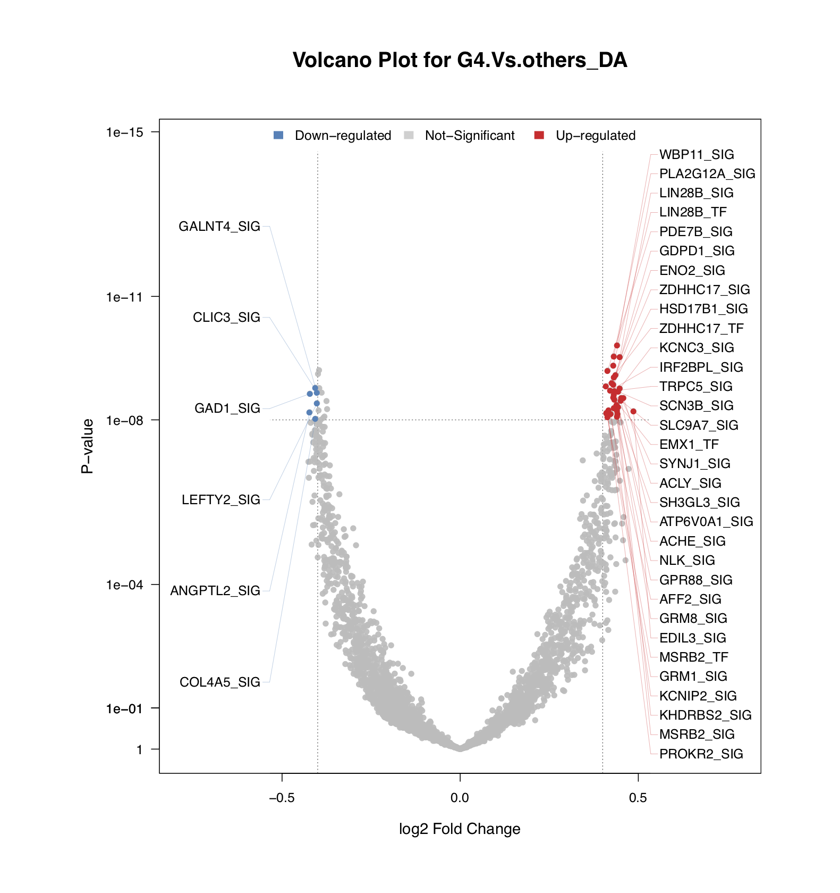

- Volcano plot is also applicable for get the top DE genes. Top genes with DE passed absolute logFC&ge;1.5 and P-value&le;1e-4 are shown:

```R
sig_gene <- draw.volcanoPlot(dat=ms_tab,label_col='geneSymbol',logFC_col=sprintf('logFC.%s_DE',comp_name),
                             Pv_col=sprintf('P.Value.%s_DE',comp_name),logFC_thre=1.5,Pv_thre=1e-4,
                             main=sprintf('Volcano Plot for %s_DE',comp_name),show_label=TRUE,
                             pdf_file=sprintf('%s/vocalno_label_DE.pdf',analysis.par$out.dir.PLOT),label_cex = 1)
```

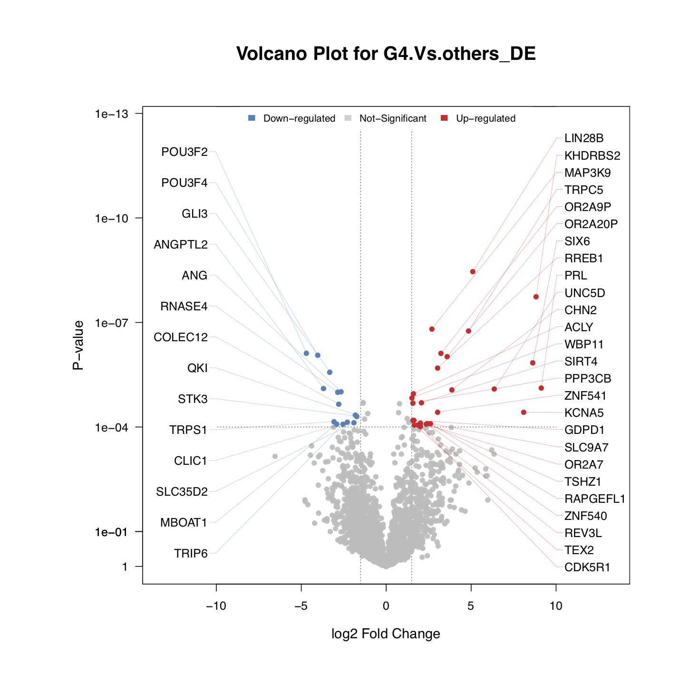

`sig_driver` and `sig_gene` are the data frame containing drivers and genes passed the threshold with detailed logFC and P.value statistics.

### QI.2: How to understand the significance of those top DA drivers ?

Those drivers are significant due to their activity difference in Group4 Vs. other subtypes. 
The activity is calculated based on the expression pattern of their target genes.
If the driver's activity is significantly up-regulated in Group4, which means that its positively regulated target genes are significantly up-regulated in Group4 and negative target genes are down-regulated.
Based on this, we could use `draw.GSEA.NetBID()` to visualize this trend for top drivers. This function has more than 10 options, check the manual for detail by `?draw.GSEA.NetBID`.

First, the differentiated expression (DE) profile in Group4 Vs. others should be used to estimate the performance of the target genes. 
And `driver_list` need to be the `originalID_label` in the master table as it is the only unique column. In the above volcano plot, the rownames for the output data frame will be the rownames from the original master table, i.e the `originalID_label`. 

```R
DE <- analysis.par$DE[[comp_name]]
driver_list <- rownames(sig_driver) ## the rownames is the originalID_label
```

The following figures differ in the option of `profile_trend`, `profile_col`, `target_nrow`, `target_col`, `target_col_type`. 

- In the first demo plot, the profile (above part of the figure) is from negative values to positive values (`profile_trend='neg2pos'`), indicating the `logFC` (set in `profile_col`) value for genes.
The position for the genes are consistent in the profile figure and the GSEA-pattern figure (below part of the figure). 
Each vertical line in each row stands for one target gene for the corresponding driver. 
The target genes for one driver will be separated into positive-regulated sets and negative-regulated sets (`target_nrow=2`).
The color for those target genes are the significance in the profile (`target_col_type='DE'`), with value passed the `profile_sig_thre` color in blue (negative value) and red (positive value).
We could study from the figure that, the positively regulated target genes for the *down* DA drivers tend to lay in the left part of the profile and the negatively regulated in the right part. Contrary trend for *up* DA drivers. 

```R
draw.GSEA.NetBID(DE=DE,profile_col='logFC',profile_trend='neg2pos',name_col='ID',
                 driver_list = driver_list,
                 show_label=ms_tab[driver_list,'gene_label'],
                 driver_DA_Z=ms_tab[driver_list,'Z.G4.Vs.others_DA'],
                 driver_DE_Z=ms_tab[driver_list,'Z.G4.Vs.others_DE'],
                 target_list=analysis.par$merge.network$target_list,
                 top_driver_number=30,target_nrow=2,target_col='RdBu',
                 left_annotation = 'high in others',right_annotation = 'high in G4',
                 main=comp_name,target_col_type='DE',Z_sig_thre=1.64,profile_sig_thre = 1.64,
                 pdf_file=sprintf('%s/NetBID_GSEA_demo1.pdf',analysis.par$out.dir.PLOT))
```


- In the second demo plot,the profile is from positive values to negative values (`profile_trend='pos2neg'`), indicating the `t` (set in `profile_col`) value for genes.
The color for those target genes are the same for positively-regulaion or negatively-regulation (`target_col_type='PN'`)

```R
draw.GSEA.NetBID(DE=DE,profile_col='t',profile_trend='pos2neg',
                 driver_list = driver_list,
                 show_label=ms_tab[driver_list,'gene_label'],
                 driver_DA_Z=ms_tab[driver_list,'Z.G4.Vs.others_DA'],
                 driver_DE_Z=ms_tab[driver_list,'Z.G4.Vs.others_DE'],
                 target_list=analysis.par$merge.network$target_list,
                 top_driver_number=30,target_nrow=2,target_col='RdBu',
                 left_annotation = 'high in G4',right_annotation = 'high in others',
                 main=comp_name,target_col_type='PN',Z_sig_thre=1.64,profile_sig_thre = 1.64,
                 pdf_file=sprintf('%s/NetBID_GSEA_demo2.pdf',analysis.par$out.dir.PLOT))
```


- In the third demo plot, the color for those target genes are just black (`target_col='black'`).

```R
draw.GSEA.NetBID(DE=DE,profile_col='t',profile_trend='pos2neg',
                 driver_list = driver_list,
                 show_label=ms_tab[driver_list,'gene_label'],
                 driver_DA_Z=ms_tab[driver_list,'Z.G4.Vs.others_DA'],
                 driver_DE_Z=ms_tab[driver_list,'Z.G4.Vs.others_DE'],
                 target_list=analysis.par$merge.network$target_list,
                 top_driver_number=30,target_nrow=2,target_col='black',
                 left_annotation = 'high in G4',right_annotation = 'high in others',
                 main=comp_name,target_col_type='PN',Z_sig_thre=1.64,profile_sig_thre = 1.64,
                 pdf_file=sprintf('%s/NetBID_GSEA_demo3.pdf',analysis.par$out.dir.PLOT))
```

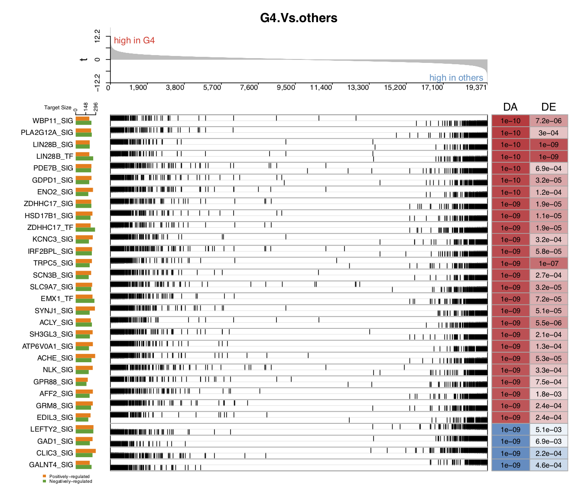

- In the forth demo plot, the positively-regulaion or negatively-regulation is not separately into two rows (`target_nrow = 1`), `target_col='RdBu'` and `target_col_type='DE'`.

```R
draw.GSEA.NetBID(DE=DE,profile_col='t',profile_trend='pos2neg',
                 driver_list = driver_list,
                 show_label=ms_tab[driver_list,'gene_label'],
                 driver_DA_Z=ms_tab[driver_list,'Z.G4.Vs.others_DA'],
                 driver_DE_Z=ms_tab[driver_list,'Z.G4.Vs.others_DE'],
                 target_list=analysis.par$merge.network$target_list,
                 top_driver_number=30,target_nrow=1,target_col='RdBu',
                 left_annotation = 'high in G4',right_annotation = 'high in others',
                 main=comp_name,target_col_type='DE',Z_sig_thre=1.64,profile_sig_thre = 1.64,
                 pdf_file=sprintf('%s/NetBID_GSEA_demo4.pdf',analysis.par$out.dir.PLOT))
```


- In the fifth demo plot, the positively-regulaion or negatively-regulation is not separately into two rows (`target_nrow = 1`) and `target_col='black'`.

```R
draw.GSEA.NetBID(DE=DE,profile_col='t',profile_trend='pos2neg',
                 driver_list = driver_list,
                 show_label=ms_tab[driver_list,'gene_label'],
                 driver_DA_Z=ms_tab[driver_list,'Z.G4.Vs.others_DA'],
                 driver_DE_Z=ms_tab[driver_list,'Z.G4.Vs.others_DE'],
                 target_list=analysis.par$merge.network$target_list,
                 top_driver_number=30,target_nrow=1,target_col='black',
                 left_annotation = 'high in G4',right_annotation = 'high in others',
                 main=comp_name,target_col_type='PN',Z_sig_thre=1.64,profile_sig_thre = 1.64,
                 pdf_file=sprintf('%s/NetBID_GSEA_demo5.pdf',analysis.par$out.dir.PLOT))
```


### QI.3: What is the expression/activity pattern of those top DA drivers in samples with different subtype ?

Next, we'd like to know the expression/activity pattern for those top DA drivers in different group of samples, the most straightforward strategy is to use heatmap.
In NetBID2, `draw.heatmap()` is designed to assist simple usage of heatmap. It is based on `Heatmap()` function in [ComplexHeatmap](https://bioconductor.org/packages/release/bioc/html/ComplexHeatmap.html). 

Get the expression matrix `exp_mat` and activity matrix `ac_mat` from `analysis.par`, and phenotype data frame `phe_info`.

```R
exp_mat <- exprs(analysis.par$cal.eset) ## expression,the rownames must be the originalID
ac_mat <- exprs(analysis.par$merge.ac.eset) ## ac,the rownames must be the originalID_label
phe_info <- pData(analysis.par$cal.eset)
# could use addtional paramters in Heatmap()
```

- Draw the expression value (scaled by samples `scale='row'`)  for top DA drivers across all samples and display the sample class label above. 
Here, the `use_genes` must be the `originalID`.
User could directly input `phenotype_info=phe_info` and choose which columns to display in `use_phe`.

```R
draw.heatmap(mat=exp_mat,use_genes=ms_tab[driver_list,'originalID'],use_gene_label=ms_tab[driver_list,'geneSymbol'],
             use_samples=colnames(exp_mat),use_sample_label=phe_info[colnames(exp_mat),'geo_accession'],
             phenotype_info=phe_info,use_phe=c('gender','pathology','subgroup','age'),main='Expression for Top drivers',scale='row',
             cluster_rows=TRUE,cluster_columns=TRUE,clustering_distance_rows='pearson',clustering_distance_columns='pearson',
             row_names_gp = gpar(fontsize = 12),pdf_file=sprintf('%s/heatmap_demo1.pdf',analysis.par$out.dir.PLOT))
```

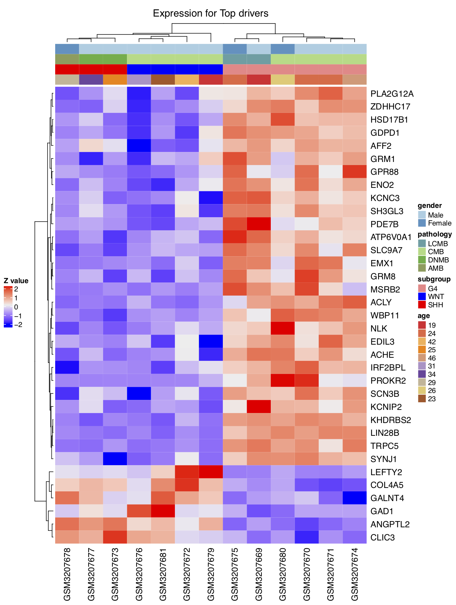

- Draw the activity value for top DA drivers, here, the `use_genes` must be the `originalID_label` but user could to display label in the `gene_label` column. 
In this demo, the original label is also gene symbol, but in some cases the original label maybe the ensemble_gene_id, the originalID will be different and user could choose to display the gene symbol in `gene_label` (set by `use_gene_label`).

```R
draw.heatmap(mat=ac_mat,use_genes=driver_list,use_gene_label=ms_tab[driver_list,'gene_label'],
             use_samples=colnames(exp_mat),use_sample_label=phe_info[colnames(exp_mat),'geo_accession'],
             phenotype_info=phe_info,use_phe=c('gender','pathology','subgroup','age'),main='Activity for Top drivers',scale='row',
             cluster_rows=TRUE,cluster_columns=TRUE,clustering_distance_rows='pearson',clustering_distance_columns='pearson',
             row_names_gp = gpar(fontsize = 12),pdf_file=sprintf('%s/heatmap_demo2.pdf',analysis.par$out.dir.PLOT))
```

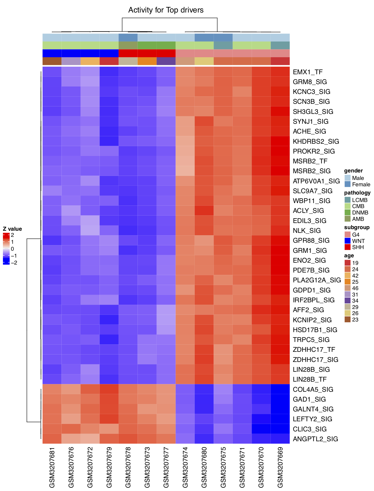

Compared with the two figures above, the activity pattern is much more clean than the expression pattern for top DA drivers, and also for top DE drivers (figures not shown here, but demo script is below), suggesting that the activity of drivers may be more robust in separating specific sample groups. 

```R
# try for the top DE genes             
gene_list <- rownames(sig_gene) 
draw.heatmap(mat=exp_mat,use_genes=ms_tab[gene_list,'originalID'],use_gene_label=ms_tab[gene_list,'geneSymbol'],
             use_samples=colnames(exp_mat),use_sample_label=phe_info[colnames(exp_mat),'geo_accession'],
             phenotype_info=phe_info,use_phe=c('gender','pathology','subgroup','age'),main='Expression for Top drivers',scale='row',
             cluster_rows=TRUE,cluster_columns=TRUE,clustering_distance_rows='pearson',clustering_distance_columns='pearson',
             row_names_gp = gpar(fontsize = 12),pdf_file=sprintf('%s/heatmap_demo3.pdf',analysis.par$out.dir.PLOT))

draw.heatmap(mat=ac_mat,use_genes= gene_list,use_gene_label=ms_tab[gene_list,'gene_label'],
             use_samples=colnames(exp_mat),use_sample_label=phe_info[colnames(exp_mat),'geo_accession'],
             phenotype_info=phe_info,use_phe=c('gender','pathology','subgroup','age'),main='Activity for Top drivers',scale='row',
             cluster_rows=TRUE,cluster_columns=TRUE,clustering_distance_rows='pearson',clustering_distance_columns='pearson',
             row_names_gp = gpar(fontsize = 12),pdf_file=sprintf('%s/heatmap_demo4.pdf',analysis.par$out.dir.PLOT))
```

### QI.4: What is the biological function of those top DA drivers ?

In order to study the function of those drivers, we could import curated gene sets from [MSigDB](http://software.broadinstitute.org/gsea/msigdb).

NetBID2 has provided one function `gs.preload()` to automatically download curated gene sets from MSigDB (based on [msigdbr](https://cran.r-project.org/web/packages/msigdbr/index.html)). 
The only input is the species name, full list of available species name could be found by msigdbr_show_species(). Default is 'Homo sapiens'. 
The dataset for human is already packed in NetBID2 R package. 
Similar as `db.preload()`, if leave `main.dir=NULL`, the RData will be saved to `system.file(package = "NetBID2")/db/`. 
If NetBID2 is installed in a public place with no permission to user, just set `main.dir` to another place and remember to use the same path next time using it.

User can print `all_gs2gene_info` to check the detailed information of the global variable `all_gs2gene`. 
The column `Category` and `Sub-Category` will be used as the label to extract categories of gene sets for use.  

```R
# load RData for all_gs2gene
gs.preload(use_spe='Homo sapiens',update=FALSE)
print(all_gs2gene_info)
```


Now, user could choose to use the pre-loaded gene sets to perform Fisher based Gene Set enrichment analysis by `funcEnrich.Fisher()`. 
The `input_list` and `bg_list` must be the gene symbol. This is easily obtained by using the `geneSymbol` column in the master table.

`gs2gene` is the list for geneset to genes, the name for the list is the gene set name and the content in each list is the vector for genes belong to that gene set. 
If NULL, will use `all_gs2gene` loaded by using `gs.preload()`. User do not need to prepare this if want to use MSigDB.

`use_gs` is the vector of category name used in analysis, this could be the mixture of category names from `Category` and `Sub-Category`. 
Do not worry about the redundant issue, all gene sets will be passed into `merge_gs()` and the gene sets with the same gene set name will be merged. 

```R
driver_list_up <- rownames(sig_driver)[which(sig_driver[,2]>0)] # up
driver_list_down <- rownames(sig_driver)[which(sig_driver[,2]<0)] # down
res_up <- funcEnrich.Fisher(input_list=ms_tab[driver_list_up,'geneSymbol'],bg_list=unique(ms_tab[,'geneSymbol']),use_gs=c('H','CP:REACTOME','BP','CGP'),
                           Pv_thre=0.1,Pv_adj = 'none',min_gs_size = 30, max_gs_size = 500)
res_down <- funcEnrich.Fisher(input_list=ms_tab[driver_list_down,'geneSymbol'],bg_list=unique(ms_tab[,'geneSymbol']),use_gs=c('H','CP:REACTOME','BP','CGP'),
                           Pv_thre=0.1,Pv_adj = 'none',min_gs_size = 30, max_gs_size = 500)                       
```

`funcEnrich.Fisher()` will return detailed results for enrichment analysis, use `?funcEnrich.Fisher` to check the detail. And the [results](fisher_res.xlsx) could be output to excel file by `out2excel()`. 

```R
out2excel(list(up=res_up,down=res_down),out.xlsx=sprintf('%s/fisher_res.xlsx',analysis.par$out.dir.PLOT))
```

Meanwhile, the enrichment analysis results can be visualized by barplot (`draw.funcEnrich.bar()`) and cluster plot (`draw.funcEnrich.cluster()`).

The barplot is a simply way to display the enriched P-value, with the example of intersected genes (if set `display_genes=TRUE`).

```R
# draw barplot
draw.funcEnrich.bar(funcEnrich_res= res_up,top_number=30,main='Function Enrichment for Top drivers',pdf_file=sprintf('%s/funcEnrich_bar_nogene.pdf',analysis.par$out.dir.PLOT))
draw.funcEnrich.bar(funcEnrich_res= res_up,top_number=30,main='Function Enrichment for Top drivers',display_genes = TRUE,gs_cex=0.6,
                    pdf_file=sprintf('%s/funcEnrich_bar_withgene.pdf',analysis.par$out.dir.PLOT))
```


Considering the function redudancy of gene sets and the cluster of genes by function similarity, the function cluster plot could be used. 

```R
draw.funcEnrich.cluster(funcEnrich_res= res_up,top_number=30,gs_cex = 1.4,gene_cex=1.5,pv_cex=1.2,pdf_file = sprintf('%s/funcEnrich_clusterBOTH.pdf',analysis.par$out.dir.PLOT),
                        cluster_gs=TRUE,cluster_gene = TRUE,h=0.95)
```

In the figure below, top 30 enriched terms could be clustered into 6 clusters (cluster size adjusted by `h`). 
We could easily get to know the related genes for each function clusters. 
Here, top enriched gene sets are related with lipid biosynthetic process, with detailed description from: e.g ['GO_LIPID_BIOSYNTHETIC_PROCESS'](http://software.broadinstitute.org/gsea/msigdb/geneset_page.jsp?geneSetName=GO_LIPID_BIOSYNTHETIC_PROCESS)


Try the below scripts and check the difference of the output figure:

```R
draw.funcEnrich.cluster(funcEnrich_res= res_up,top_number=30,gs_cex = 0.8,gene_cex=0.9,pv_cex=0.8,pdf_file = sprintf('%s/funcEnrich_clusterGS.pdf',analysis.par$out.dir.PLOT),
                        cluster_gs=TRUE,cluster_gene = FALSE)
draw.funcEnrich.cluster(funcEnrich_res= res_up,top_number=30,gs_cex = 0.8,gene_cex=0.9,pv_cex=0.8,pdf_file = sprintf('%s/funcEnrich_clusterGENE.pdf',analysis.par$out.dir.PLOT),
                        cluster_gs=FALSE,cluster_gene = TRUE)
draw.funcEnrich.cluster(funcEnrich_res= res_up,top_number=30,gs_cex = 1.5,gene_cex=1.4,pv_cex=1.2,pdf_file = sprintf('%s/funcEnrich_clusterNO.pdf',analysis.par$out.dir.PLOT),
                        cluster_gs=FALSE,cluster_gene = FALSE)
```

### QI.5: What is the biological function of the target genes of those top DA drivers ?

The function of those drivers is to regulate their target genes. Then, we will ask what is the biological function of the target genes of those top DA drivers ?
NetBID2 has one function `draw.bubblePlot()` to calculate and visualize this purpose. 

Before that, we only accept gene symbol as the ID for gene set annotation (for the general usage, other kinds of usage will be shown in the last part of this section), so, we need to prepare a transfer table to transfer the originalID into gene symbol for all drivers and target genes.
This transfer table is already saved in the `analysis.par`.

```R
transfer_tab <- analysis.par$transfer_tab
```

This function has 21 options, but for the first trial, just follow the demo and the only thing to prepare is the transfer table (`transfer2symbol2type`). 
Lots of parameters are the same as in `funcEnrich.Fisher()`. 

```R
## draw
draw.bubblePlot(driver_list= driver_list,show_label=ms_tab[driver_list,'gene_label'],
                Z_val=ms_tab[driver_list,'Z.G4.Vs.others_DA'],
                driver_type=ms_tab[driver_list,'gene_biotype'],
                target_list=analysis.par$merge.network$target_list,transfer2symbol2type=transfer_tab,
                bg_list=ms_tab[,'geneSymbol'],min_gs_size=5,max_gs_size=500,use_gs=c('H'),
                top_geneset_number=30,top_driver_number=10,
                pdf_file = sprintf('%s/bubblePlot.pdf',analysis.par$out.dir.PLOT),
                main='Bubbleplot for top driver targets')
```

Each column in this plot is one driver, each row is the curated gene set, and the circle in the main plot region shows the significance of the target genes for the driver in the corresponding gene set.
The size of the circle is the intersected gene number (legend on the top) and the color of the circle represents the significance of the P-value (legend on the right). The color boxes down below the main figure are the significance of the drivers (user need to input the Z-statistics), followed by the barplots showing the target size of the driver (filtered by protein coding), and the color cicles below showing the drivers' type (optional, if user input the `driver_type`).

The figure could tell user that, e.g the target genes of the Group4 up-regulated driver`PDE7B_SIG` are significantly enriched in `KEGG_AXON_GUIDANCE` with 17 intersected genes and P-value at about 1e-10. 

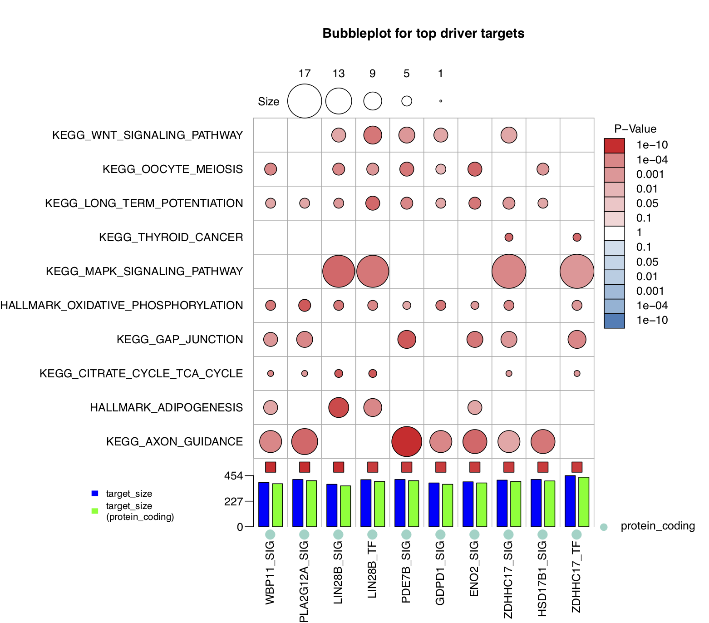

Try the following script to get familiar with the options in the function. 

```R
draw.bubblePlot(driver_list= driver_list,show_label=ms_tab[driver_list,'gene_label'],
                Z_val=ms_tab[driver_list,'Z.G4.Vs.others_DA'],
                driver_type=ms_tab[driver_list,'gene_biotype'],
                target_list=analysis.par$merge.network$target_list,transfer2symbol2type=transfer_tab,
                bg_list=ms_tab[,'geneSymbol'],min_gs_size=10,max_gs_size=300,use_gs=c('CP:KEGG'),
                top_geneset_number=30,top_driver_number=30,
                pdf_file = sprintf('%s/bubblePlot_KEGG.pdf',analysis.par$out.dir.PLOT),
                main='Bubbleplot for top driver targets')
# add marker gene
mark_gene <- c('KCNA1','EOMES','KHDRBS2','RBM24','UNC5D') ## marker for Group4
draw.bubblePlot(driver_list= driver_list,show_label=ms_tab[rownames(sig_driver),'gene_label'],
                Z_val=ms_tab[driver_list,'Z.G4.Vs.others_DA'],
                driver_type=ms_tab[driver_list,'gene_biotype'],
                target_list=analysis.par$merge.network$target_list,transfer2symbol2type=transfer_tab,
                bg_list=ms_tab[,'geneSymbol'],min_gs_size=10,max_gs_size=300,use_gs=c('CP:KEGG','CP:BIOCARTA','H'),
                top_geneset_number=30,top_driver_number=80,
                pdf_file = sprintf('%s/bubblePlot_combine.pdf',analysis.par$out.dir.PLOT),
                main='Bubbleplot for top driver targets',
                mark_gene=ms_tab[which(ms_tab$geneSymbol %in% mark_gene),'originalID_label'],gs_cex = 1,driver_cex=1.2)
```


## Part II: for a selected interested driver

### QII.1: How to understand the significance of the selected driver ?
GSEA plot for each driver

```R
DE <- analysis.par$DE[[comp_name]]
DE_profile <- DE$`Z-statistics`; 
names(DE_profile) <- rownames(DE)
```

```R
use_driver <- driver_list[1]
use_target_genes <- analysis.par$merge.network$target_list[[use_driver]]$target
use_target_direction <- sign(analysis.par$merge.network$target_list[[use_driver]]$spearman) ## 1/-1
annot <- sprintf('P-value: %s',signif(ms_tab[use_driver,sprintf('P.Value.%s_DA',comp_name)],2))
```

```R
## with direction
draw.GSEA(rank_profile=DE_profile,use_genes=use_target_genes,use_direction=use_target_direction,
          main=sprintf('GSEA plot for driver %s',ms_tab[use_driver,'gene_label']),
          pdf_file = sprintf('%s/GSEA_each_direction.pdf',analysis.par$out.dir.PLOT),
          annotation=annot,annotation_cex=1.2,
          left_annotation='high in G4',right_annotation='high in others')
```

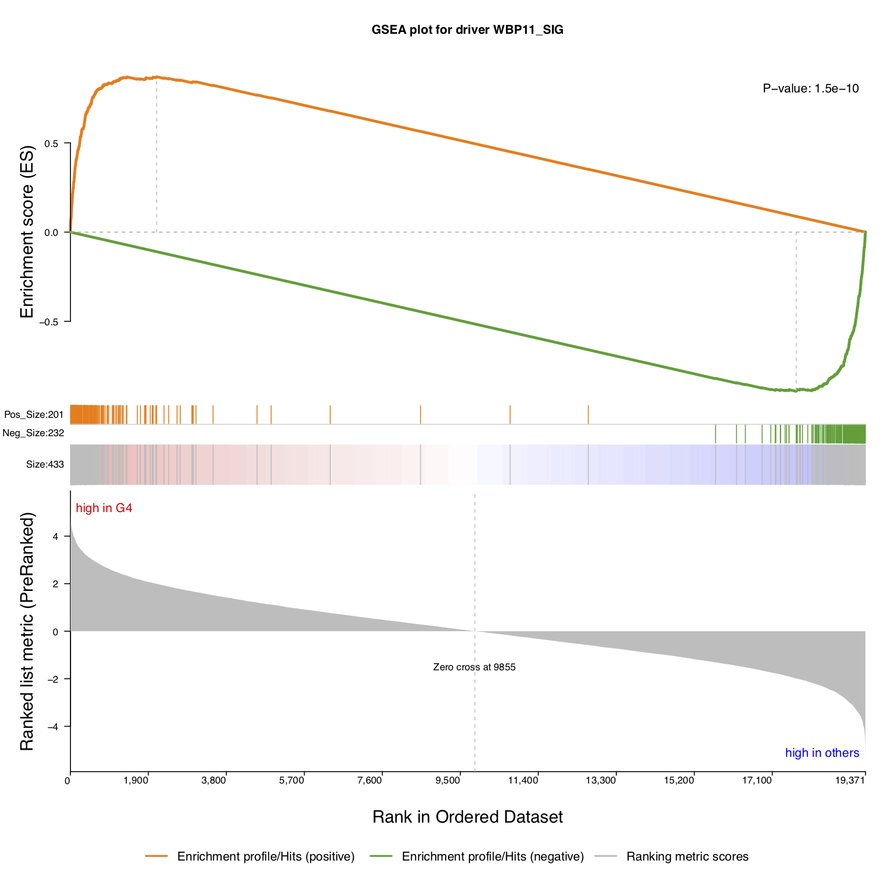

If do not enter direction information, it will be normal GSEA plot.

```R
## GSEA plot without direction, without annotation, traditional GSEA plot
draw.GSEA(rank_profile=DE_profile,use_genes=use_target_genes,use_direction=NULL,
          main=sprintf('GSEA plot for driver %s',ms_tab[use_driver,'gene_label']),
          pdf_file = sprintf('%s/GSEA_each.pdf',analysis.par$out.dir.PLOT),
          annotation='',annotation_cex=1.2,
          left_annotation='high in G4',right_annotation='high in others')
```

### QII.2: How to visualize the network structure of the selected driver ?

```R
use_driver <- driver_list[1]
use_driver2 <- driver_list[2]

edge_score <- analysis.par$merge.network$target_list[[use_driver]]$MI*sign(analysis.par$merge.network$target_list[[use_driver]]$spearman)
names(edge_score) <- analysis.par$merge.network$target_list[[use_driver]]$target
#
edge_score2 <- analysis.par$merge.network$target_list[[use_driver2]]$MI*sign(analysis.par$merge.network$target_list[[use_driver2]]$spearman)
names(edge_score2) <- analysis.par$merge.network$target_list[[use_driver2]]$target
```

```R
draw.targetNet(source_label=ms_tab[use_driver,'gene_label'],source_z=ms_tab[use_driver,'Z.G4.Vs.others_DA'],
               edge_score = edge_score,pdf_file=sprintf('%s/targetNet_out.pdf',analysis.par$out.dir.PLOT),label_cex = 0.4,n_layer=4)
```

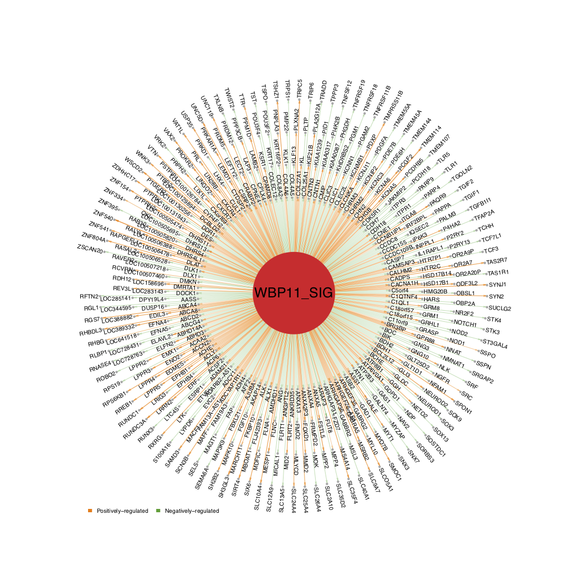

The arrow direction could be changed: 

```R
draw.targetNet(source_label=ms_tab[use_driver,'gene_label'],source_z=ms_tab[use_driver,'Z.G4.Vs.others_DA'],
               edge_score = edge_score,pdf_file=sprintf('%s/targetNet_in.pdf',analysis.par$out.dir.PLOT),label_cex = 0.4,arrow_direction = 'in',,n_layer=4)
```

```R
# for two target
use_genes <- unique(analysis.par$merge.network$network_dat$target.symbol)
draw.targetNet.TWO(source1_label=ms_tab[use_driver,'gene_label'],edge_score1 = edge_score,
                   source2_label=ms_tab[use_driver2,'gene_label'],edge_score2 = edge_score2,
                   source1_z=ms_tab[use_driver,'Z.G4.Vs.others_DA'],source2_z=ms_tab[use_driver2,'Z.G4.Vs.others_DA'],
                   pdf_file=sprintf('%s/targetNetTWO.pdf',analysis.par$out.dir.PLOT),total_possible_target=use_genes,show_test=TRUE,label_cex = 0.2)
```

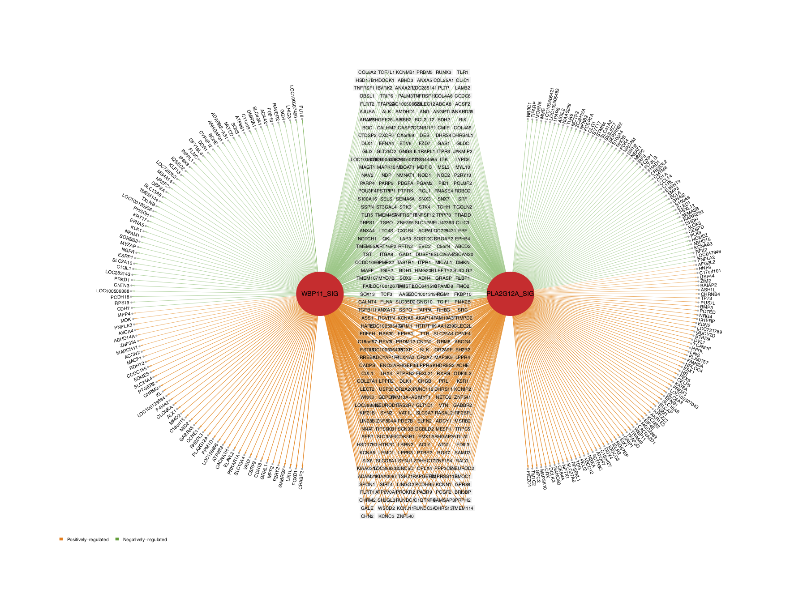


```R
# or directly get the test result
test.targetNet.overlap(source1_label=ms_tab[use_driver,'gene_label'],source2_label=ms_tab[use_driver2,'gene_label'],
                       target1 = names(edge_score),target2 = names(edge_score2),total_possible_target=use_genes)
```

### QII.3: What is the expression/activity for this selected driver in samples with different subtypes ?

```R
use_obs_class <- get_obs_label(phe_info = phe_info,'subgroup')
#
draw.categoryValue(ac_val=ac_mat[use_driver,],exp_val=exp_mat[ms_tab[use_driver,'originalID'],],use_obs_class=use_obs_class,
                   class_order=c('WNT','SHH','G4'),class_srt=30,main_ac = ms_tab[use_driver,'gene_label'],main_exp=ms_tab[use_driver,'geneSymbol'],
                   pdf_file=sprintf('%s/categoryValue_demo1.pdf',analysis.par$out.dir.PLOT))
```
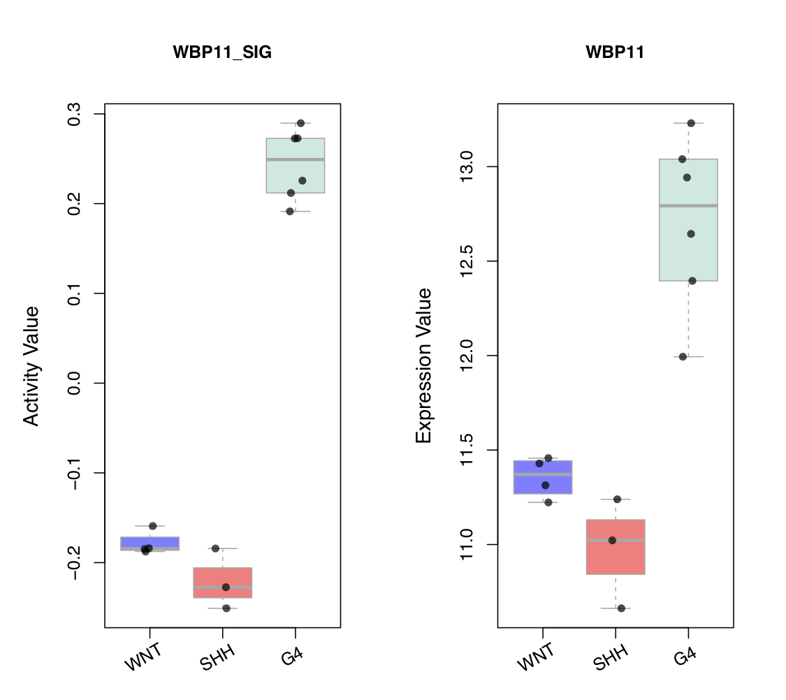

Try the below script to check what is different:

```R
draw.categoryValue(ac_val=ac_mat[use_driver,],exp_val=NULL,use_obs_class=use_obs_class,class_order=c('WNT','SHH','G4'),
                   pdf_file=sprintf('%s/categoryValue_demo2.pdf',analysis.par$out.dir.PLOT))
use_obs_class <- get_obs_label(phe_info = phe_info,c('subgroup','gender'))
draw.categoryValue(ac_val=ac_mat[use_driver,],exp_val=exp_mat[ms_tab[use_driver,'originalID'],],use_obs_class=use_obs_class,
                   class_srt=30,main_ac = ms_tab[use_driver,'gene_label'],main_exp=ms_tab[use_driver,'geneSymbol'],
                   pdf_file=sprintf('%s/categoryValue_demo3.pdf',analysis.par$out.dir.PLOT))
```


### QII.4: What is the function of the target genes for this selected driver ?

```R
use_driver <- driver_list[1]
use_target_genes <- analysis.par$merge.network$target_list[[use_driver]]$target
use_target_genes <- get_name_transfertab(use_genes= use_target_genes,transfer_tab=transfer_tab,ignore_version=TRUE)	
bg_list <- get_name_transfertab(use_genes= unique(analysis.par$merge.network$network_dat$target),transfer_tab=transfer_tab,ignore_version=TRUE)	
res <- funcEnrich.Fisher(input_list= use_target_genes,bg_list= bg_list,use_gs=c('H','CP:REACTOME','BP','CGP','CP:KEGG'),
                           Pv_thre=0.1,Pv_adj = 'none',min_gs_size = 30, max_gs_size = 500)
draw.funcEnrich.cluster(funcEnrich_res= res,top_number=20,gs_cex = 1.2,gene_cex=1,pv_cex=1,Pv_thre=0.1,
                        pdf_file = sprintf('%s/funcEnrich_clusterBOTH_%s.pdf',analysis.par$out.dir.PLOT,use_driver),
                        cluster_gs=TRUE,cluster_gene = TRUE,h=0.95)
```


## Part III: further analysis

### QIII.1: What are the activities of the curated gene sets in all samples and what are the top significantly differed gene sets ?

```R
db.preload(use_level='gene',use_spe='human',update=FALSE)
exp_mat <- exprs(analysis.par$cal.eset) ## expression,the rownames must be the originalID
## get expression matrix for the transfered gene name, if original is gene-based expression matrix, just use the exp_mat
exp_mat_gene <- exp_mat
```

```R
## calculate activity for all genesets
use_gs2gene <- merge_gs(all_gs2gene=all_gs2gene,use_gs=c('H','CP:BIOCARTA','CP:REACTOME','CP:KEGG','C5'))
ac_gs <- cal.Activity.GS(use_gs2gene = use_gs2gene,cal_mat = exp_mat_gene)
```

```R
## get DA
phe_info <- pData(analysis.par$cal.eset)
G0  <- rownames(phe_info)[which(phe_info$`subgroup`!='G4')] # get sample list for G0
G1  <- rownames(phe_info)[which(phe_info$`subgroup`=='G4')] # get sample list for G1
DA_gs_bid <- getDE.BID.2G(eset=generate.eset(ac_gs),G1=G1,G0=G0,G1_name='G4',G0_name='others')
```

```R
## draw vocalno plot for top sig-GS
sig_gs <- draw.volcanoPlot(dat= DA_gs_bid,label_col='ID',logFC_col='logFC',
                               Pv_col='P.Value',logFC_thre=0.2,Pv_thre=1e-3,
                               main='Volcano Plot for gene sets',show_label=TRUE,label_type = 'distribute',label_cex = 0.5,
                               pdf_file=sprintf('%s/vocalno_GS_DA.pdf',analysis.par$out.dir.PLOT))
```

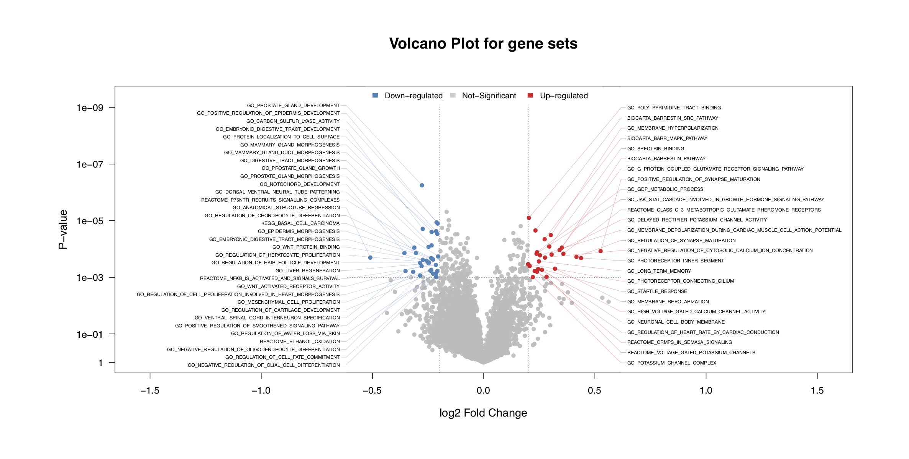


```R
## draw heatmap for top sig-GS
draw.heatmap(mat=ac_gs[sig_gs$ID,],pdf_file=sprintf('%s/heatmap_GS.pdf',analysis.par$out.dir.PLOT),scale='row',
             phenotype_info=phe_info,use_phe=c('gender','subgroup'))
```

```R
## draw GSEA plot for top sig-GS
comp <- 'G4.Vs.others'
DE <- analysis.par$DE[[comp]]
#
draw.GSEA.NetBID.GS(DE=DE,name_col='ID',profile_col='t',profile_trend='pos2neg',
                 sig_gs_list = sig_gs$ID,
                 gs_DA_Z= DA_gs_bid[sig_gs$ID,'Z-statistics'],
                 use_gs2gene = use_gs2gene,
                 top_gs_number=20,target_col='RdBu',
                 left_annotation = 'high in others',right_annotation = 'high in G4',
                 main= comp_name,Z_sig_thre=1.64,profile_sig_thre = 0,
                 pdf_file=sprintf('%s/NetBID_GSEA_GS_demo1.pdf',analysis.par$out.dir.PLOT))
```


```R
draw.GSEA.NetBID.GS(DE=DE,name_col='ID',profile_col='t',profile_trend='pos2neg',
                    sig_gs_list = sig_gs$ID,
                    gs_DA_Z= DA_gs_bid[sig_gs$ID,'Z-statistics'],
                    use_gs2gene = use_gs2gene,
                    top_gs_number=20,target_col='black',
                    left_annotation = 'high in others',right_annotation = 'high in G4',
                    main= comp_name,Z_sig_thre=1.64,profile_sig_thre = 0,
                    pdf_file=sprintf('%s/NetBID_GSEA_GS_demo2.pdf',analysis.par$out.dir.PLOT))
```


```R
## draw GSEA plot for each sig-GS
DE_profile <- DE$`Z-statistics`; names(DE_profile) <- rownames(DE)
use_target_genes <- rownames(DE)[which(DE$ID %in% use_gs2gene[[sig_gs$ID[1]]])]
draw.GSEA(rank_profile=DE_profile,use_genes=use_target_genes,
          main=sprintf('GSEA plot for %s',sig_gs$ID[1]),
          pdf_file = sprintf('%s/GSEA_GS_each.pdf',analysis.par$out.dir.PLOT),
          left_annotation='high in G4',right_annotation='high in others')
```

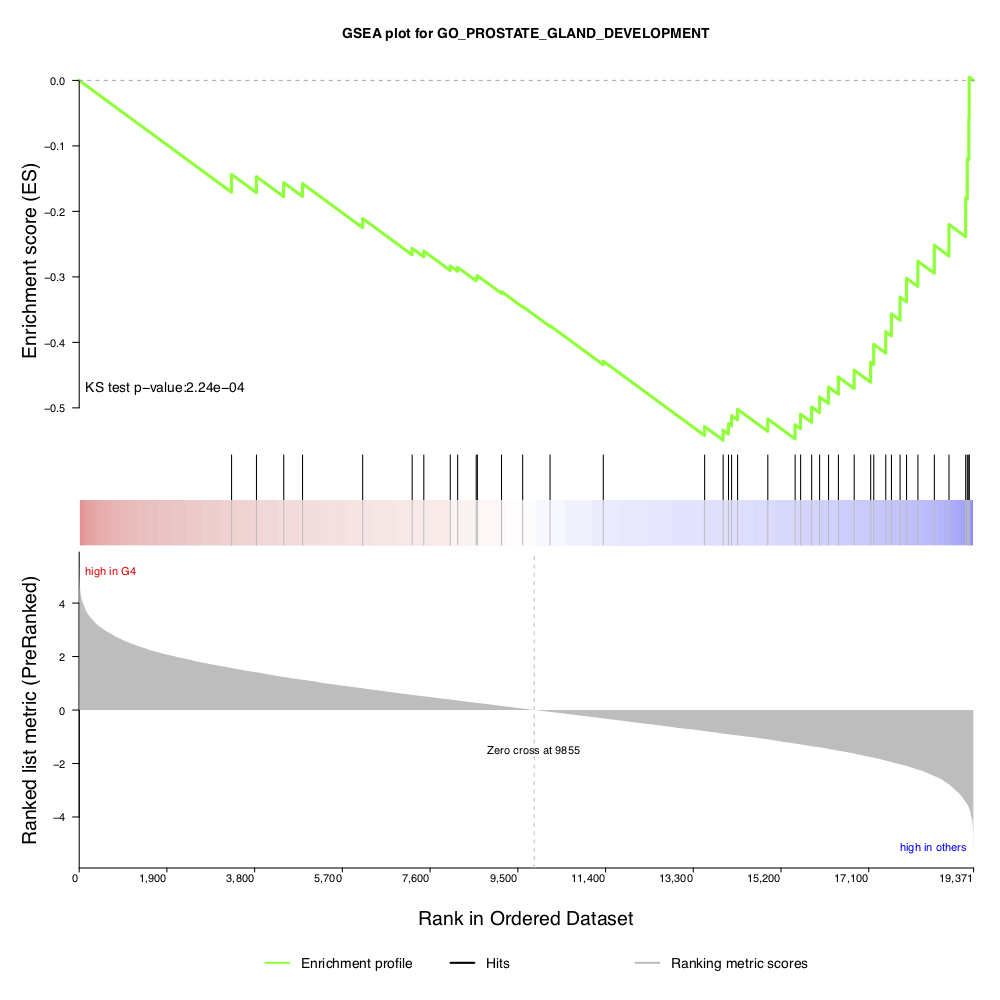


```R
## draw category plot for each sig-GS
use_obs_class <- get_obs_label(phe_info = phe_info,'subgroup')
draw.categoryValue(ac_val=ac_gs[sig_gs$ID[1],],use_obs_class=use_obs_class,
                   class_order=c('WNT','SHH','G4'),class_srt=30,pdf_file=sprintf('%s/categoryValue_GS_demo1.pdf',analysis.par$out.dir.PLOT),
                   main_ac=sig_gs$ID[1],main_cex=0.8)
```

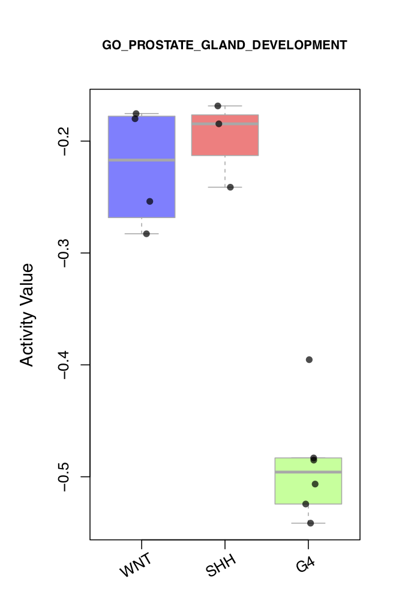


### QIII.2: How to find drivers with significantly overlapped target genes ?


```R
gs2gene_target <- analysis.par$merge.network$target_list[driver_list]
gs2gene_target <- lapply(gs2gene_target,function(x)x$target)
transfer_tab_fake <- data.frame(from=transfer_tab[,1],to=transfer_tab[,1],type=transfer_tab[,3],stringsAsFactors=F)
draw.bubblePlot(driver_list= driver_list,show_label=ms_tab[driver_list,'gene_label'],
                Z_val=ms_tab[driver_list,'Z.G4.Vs.others_DA'],
                driver_type=ms_tab[driver_list,'gene_biotype'],
                target_list=analysis.par$merge.network$target_list,transfer2symbol2type=transfer_tab_fake,
                bg_list=ms_tab[,'geneSymbol'],gs2gene=gs2gene_target,
                min_gs_size=10,max_gs_size=1000,
                use_gs='all',
                top_geneset_number=10,top_driver_number=10,
                pdf_file = sprintf('%s/bubblePlot_overlap.pdf',analysis.par$out.dir.PLOT),
                main='Bubbleplot for top driver targets')
```


-------
### *How to modify the figures by adjusting the paramters in the draw.* functions ?*


-------
