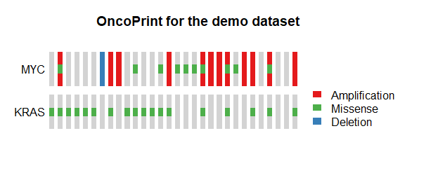

## Advanced analysis and visualization

The purpose of this part: 

**further analysis and visualization of the significant drivers**.

A “lazy mode” function without flexible options is available for this part of the analysis: `NetBID.lazyMode.DriverVisualization()`. 
The user can find information about this function in the manual and try using the demo code.
The complete step-by-step demo script for result visualization can be found here: [analysis_and_plot_demo1.R](https://github.com/jyyulab/NetBID-dev/blob/master/demo_scripts/analysis_and_plot_demo1.R).

From the demo dataset, we have found significant hidden drivers in Group 4 MB, as compared to the other subtype groups. These drivers may relate to specific clinical features of adult Group 4 MB; hence, further investigation is needed. Here, we have listed some important biological questions that can be investigated further by using NetBID2.

----------
## Quick Navigation for this page

- [Preparations](#preparations)
- [Part I: More details about the top drivers](#part-i-more-details-about-the-top-drivers)
    - [QI.1: How do I obtain the top drivers with significant differential activity (DA) in the comparison of G4 MB vs. other subtypes ?](../docs/advanced_analysis#qi1-how-do-i-obtain-the-top-drivers-with-significant-differential-activity-da-in-the-comparison-of-g4-vs-other-subtypes-)
    - [QI.2: How do I interpret the significance of the top DA drivers ?](../docs/advanced_analysis#qi2-how-do-i-interpret-the-significance-of-the-top-da-drivers-)
    - [QI.3: What is the expression/activity pattern of these top DA drivers across sample subtypes?](#qi3-what-is-the-expressionactivity-pattern-of-these-top-da-drivers-across-sample-subtypes)
    - [QI.4: What are the biological functions of these top DA drivers ?](#qi4-what-are-the-biological-functions-of-these-top-da-drivers-)
    - [QI.5: What are the biological functions of the target genes of these top DA drivers ?](#qi5-what-are-the-biological-functions-of-the-target-genes-of-these-top-da-drivers-)
- [Part II: More details about the selected driver](#part-ii-more-details-about-the-selected-driver)
    - [QII.1: How do I interpret the significance of the selected driver ?](#qii1-how-do-i-interpret-the-significance-of-the-selected-driver-)
    - [QII.2: How do I visualize the network structure of the selected driver ?](#qii2-how-do-i-visualize-the-network-structure-of-the-selected-driver-)
    - [QII.3: What is the expression/activity of this selected driver across samples of different subtypes ?](../docs/advanced_analysis#qii3-what-is-the-expressionactivity-of-this-selected-driver-across-samples-of-different-subtypes)
    - [QII.4: What are the functions of the target genes of this selected driver ?](#qii4-what-are-the-functions-of-the-target-genes-of-this-selected-driver-)
- [Part III: Other analyses that NetBID2 can perform](../docs/advanced_analysis#part-iii-other-analyses-that-netbid2-can-perform)
    - [QIII.1: What are the activities of the curated gene sets across all samples ?](#qiii1-what-are-the-activities-of-the-curated-gene-sets-across-all-samples)
    - [QIII.2: How do I determine whether drivers share significantly overlapping target genes ?](../docs/advanced_analysis#qiii2-how-do-i-determine-whether-drivers-share-significantly-overlapping-target-genes-)
    - [QIII.3: How do I draw oncoPrint figures for samples with different mutation information ?](#qiii3-how-do-i-draw-oncoprint-figures-for-samples-with-different-mutation-information-)
      - [Q&A: How to modify the figure size created by `draw.` functions ?](#how-to-modify-the-figure-size-created-by-draw-functions-)
    
---------


## Preparations

Make sure you have the NetBID2 package. 

```R
library(NetBID2)
```

Reload the previously saved RData from `ms-tab` step. Here, we use the demo data from the NetBID2 package. The user can call `analysis.par$out.dir.PLOT` to see where the plots created by the later pipeline will be saved. This can be modified.

```R
# Give file path to reload `ms-tab` RData from driver inference step
analysis.par <- list()
# Here we use demo data from NetBID2 package
analysis.par$out.dir.DATA <- system.file('demo1','driver/DATA/',package = "NetBID2")
NetBID.loadRData(analysis.par=analysis.par,step='ms-tab')
# To see where the plots created later will be saved
print(analysis.par$out.dir.PLOT)
#analysis.par$out.dir.PLOT <- 'test/driver/PLOT' # Users can modify this path
```

## Part I: More details about the top drivers 

### QI.1: How do I obtain the top drivers with significant differential activity (DA) in the comparison of G4 MB vs. other subtypes.

First, retrieve the master table element from the `analysis.par` super list and pass it to a new variable `ms_tab`. 
Filter out drivers with target size that is too small (e.g., <30 target genes) or too big (e.g., >1000 target genes). Define the comparison name `comp_name` as `G4.Vs.others`.

```R
ms_tab <- analysis.par$final_ms_tab ## get the master table data frame
ms_tab <- ms_tab[which(ms_tab$Size>=30 & ms_tab$Size <=1000),] 
comp_name <- 'G4.Vs.others' ## get the comparison name
```

- To identify top DA drivers quickly from a large dataset, NetBID2 uses a volcano plot `draw.volcanoPlot()`. In this special scatter plot, the y-axis shows the significance of the DA driver and the x-axis shows the fold-change.

More handlers of `draw.volcanoPlot()`:

  - The input data frame must contain columns for `label_col`, `logFC_col` and `Pv_col`. 
  - To set thresholds, please use `logFC_thre` (for the logFC) and `Pv_thre` (for the P-value).
  - To turn off the figure display and only return the top driver list, please set `show_plot=FALSE`.
  - To show the driver labels that passed the threshold only, please set `show_label=TRUE`.
  - If you set `std=TRUE` to `cal.Activity()`, the threshold of the logFC of the activity value should not be set very high.

The figure below shows the top DA drivers that passed the thresholds of logFC&ge;0.4 and P-value&le;1e-8.

```R
sig_driver <- draw.volcanoPlot(dat=ms_tab,label_col='gene_label',logFC_col=sprintf('logFC.%s_DA',comp_name),
                               Pv_col=sprintf('P.Value.%s_DA',comp_name),logFC_thre=0.4,Pv_thre=1e-8,
                               main=sprintf('Volcano Plot for %s_DA',comp_name),show_label=TRUE,
                               pdf_file=sprintf('%s/vocalno_label_DA.pdf',analysis.par$out.dir.PLOT),label_cex = 1)
```                               


- `draw.volcanoPlot()` is also applicable to visualize the top DE genes. The figure below shows the top genes with DE that passed the thresholds of  logFC&ge;1.5 and P-value&le;1e-4.

```R
sig_gene <- draw.volcanoPlot(dat=ms_tab,label_col='geneSymbol',logFC_col=sprintf('logFC.%s_DE',comp_name),
                             Pv_col=sprintf('P.Value.%s_DE',comp_name),logFC_thre=1.5,Pv_thre=1e-4,
                             main=sprintf('Volcano Plot for %s_DE',comp_name),show_label=TRUE,
                             pdf_file=sprintf('%s/vocalno_label_DE.pdf',analysis.par$out.dir.PLOT),label_cex = 1)
```


- The returned `sig_driver` and `sig_gene` are the data frames containing drivers and genes that passed the thresholds.

### QI.2: How do I to interpret the significance of the top DA drivers ?

The activity of a driver is evaluated based on the expression pattern of its target genes. Therefore, if the activity value of a driver is significantly upregulated in G4 MB, as compared with other subtypes, this can be caused in two ways: (a) the positively-regulated target genes are significantly upregulated in G4, as compared with other subtypes; or (b) the negatively-regulated target genes are significantly downregulated in G4 MB, as compared with other subtypes.

`draw.GSEA.NetBID()` helps the user to interpret the significance of these top DA drivers based on the expression and regulation of their target genes.
First, obtain the differential expression (DE) data frame of the target genes from the comparison of Group 4 vs. others. Here, we need to pay attention to the gene ID type. The ID type should be the `originalID_label` column from the master table, i.e., the same ID type that we used to draw the volcano plot.

```R
# Get the DE data frame of target genes
DE <- analysis.par$DE[[comp_name]]
driver_list <- rownames(sig_driver) # The rownames is the originalID_label
```

The following five figures show the same content. Their purpose is to list the various visualizations that `draw.GSEA.NetBID()` can provide.
The key handlers are `profile_trend`, `profile_col`, `target_nrow`, `target_col`, and `target_col_type`.

- In the first demo plot below, 
the top figure is a metric for the ranking of genes based on their `logFC` values (`profile_col`). The order of ranking is from negative values to positive values (`profile_trend='neg2pos'`). The bottom figure has three parts: on the left is a horizontal barplot showing the target size of upregulated and downregulated genes for each driver; in the middle are panels marking the ranking position of each target gene (the panel number for each driver can be 1 or 2; here `target_nrow=2`), and the name of the color palette used for target gene marker lines is `target_col_type='DE'`; on the right are the DA and DE values for each driver (using the threshold `profile_sig_thre`, where blue is negative and red is positive). 

From the figure below, we can see that the positively regulated target genes of the *down* DA drivers tend to have lower logFC expression values in G4 MB, as compared with other subtypes. For the *up* DA drivers, the opposite is the case. For example, the GALNT4_SIG driver has a significantly negative activity value in G4, as compared with other subtypes (marked in blue, the P value is 1e−09). This driver has around 160 positively regulated target genes (the orange bar on the left), and most of their logFC values are negative, with high rankings (in the panel with blue and grey marker lines). This means that these positively regulated target genes have significant negative logFC values in G4 MB, as compared with other subtypes, and vice versa for the negatively regulated target genes. These two expression patterns of target genes contribute to the DA value of their driver.

```R
draw.GSEA.NetBID(DE=DE,profile_col='logFC',profile_trend='neg2pos',name_col='ID',
                 driver_list = driver_list,
                 show_label=ms_tab[driver_list,'gene_label'],
                 driver_DA_Z=ms_tab[driver_list,sprintf('Z.%s_DA',comp_name)],
                 driver_DE_Z=ms_tab[driver_list,sprintf('Z.%s_DE',comp_name)],
                 target_list=analysis.par$merge.network$target_list,
                 top_driver_number=30,target_nrow=2,target_col='RdBu',
                 left_annotation = 'high in others',right_annotation = 'high in G4',
                 main=comp_name,target_col_type='DE',Z_sig_thre=1.64,profile_sig_thre = 1.64,
                 pdf_file=sprintf('%s/NetBID_GSEA_demo1.pdf',analysis.par$out.dir.PLOT))
```


- In the second demo plot below, the top figure is a metric for the ranking of genes based on their `t` values (`profile_col`). The order of ranking is from positive values to negative values (`profile_trend='pos2neg'`). The name of the color palette used for target gene marker lines is `target_col_type='PN'`.

```R
draw.GSEA.NetBID(DE=DE,profile_col='t',profile_trend='pos2neg',
                 driver_list = driver_list,
                 show_label=ms_tab[driver_list,'gene_label'],
                 driver_DA_Z=ms_tab[driver_list,sprintf('Z.%s_DA',comp_name)],
                 driver_DE_Z=ms_tab[driver_list,sprintf('Z.%s_DE',comp_name)],
                 target_list=analysis.par$merge.network$target_list,
                 top_driver_number=30,target_nrow=2,target_col='RdBu',
                 left_annotation = 'high in G4',right_annotation = 'high in others',
                 main=comp_name,target_col_type='PN',Z_sig_thre=1.64,profile_sig_thre = 1.64,
                 pdf_file=sprintf('%s/NetBID_GSEA_demo2.pdf',analysis.par$out.dir.PLOT))
```


- In the third demo plot below, the color used to mark those target genes is black (`target_col='black'`).

```R
draw.GSEA.NetBID(DE=DE,profile_col='t',profile_trend='pos2neg',
                 driver_list = driver_list,
                 show_label=ms_tab[driver_list,'gene_label'],
                 driver_DA_Z=ms_tab[driver_list,sprintf('Z.%s_DA',comp_name)],
                 driver_DE_Z=ms_tab[driver_list,sprintf('Z.%s_DE',comp_name)],
                 target_list=analysis.par$merge.network$target_list,
                 top_driver_number=30,target_nrow=2,target_col='black',
                 left_annotation = 'high in G4',right_annotation = 'high in others',
                 main=comp_name,target_col_type='PN',Z_sig_thre=1.64,profile_sig_thre = 1.64,
                 pdf_file=sprintf('%s/NetBID_GSEA_demo3.pdf',analysis.par$out.dir.PLOT))
```


- In the fourth demo plot below, the number of panels used to mark the ranking position of each target gene is 1, `target_nrow=1`. The user can set `target_col='RdBu'` and `target_col_type='DE'` to distinguish positively regulated target genes from negatively regulated target genes.

```R
draw.GSEA.NetBID(DE=DE,profile_col='t',profile_trend='pos2neg',
                 driver_list = driver_list,
                 show_label=ms_tab[driver_list,'gene_label'],
                 driver_DA_Z=ms_tab[driver_list,sprintf('Z.%s_DA',comp_name)],
                 driver_DE_Z=ms_tab[driver_list,sprintf('Z.%s_DE',comp_name)],
                 target_list=analysis.par$merge.network$target_list,
                 top_driver_number=30,target_nrow=1,target_col='RdBu',
                 left_annotation = 'high in G4',right_annotation = 'high in others',
                 main=comp_name,target_col_type='DE',Z_sig_thre=1.64,profile_sig_thre = 1.64,
                 pdf_file=sprintf('%s/NetBID_GSEA_demo4.pdf',analysis.par$out.dir.PLOT))
```


- In the fifth demo plot below,  the number of panels used to mark the ranking position of each target gene is 1, `target_nrow=1`, and all of the target gene marker lines are black, `target_col='black'`.

```R
draw.GSEA.NetBID(DE=DE,profile_col='t',profile_trend='pos2neg',
                 driver_list = driver_list,
                 show_label=ms_tab[driver_list,'gene_label'],
                 driver_DA_Z=ms_tab[driver_list,sprintf('Z.%s_DA',comp_name)],
                 driver_DE_Z=ms_tab[driver_list,sprintf('Z.%s_DE',comp_name)],
                 target_list=analysis.par$merge.network$target_list,
                 top_driver_number=30,target_nrow=1,target_col='black',
                 left_annotation = 'high in G4',right_annotation = 'high in others',
                 main=comp_name,target_col_type='PN',Z_sig_thre=1.64,profile_sig_thre = 1.64,
                 pdf_file=sprintf('%s/NetBID_GSEA_demo5.pdf',analysis.par$out.dir.PLOT))
```


### QI.3: What is the expression/activity pattern of these top DA drivers across sample subtypes?

Next, we would like to know the expression/activity pattern of these top DA drivers from different sample subtypes. In NetBID2, `draw.heatmap()` is designed to assist with this by using a user-friendly heatmap. It is based on the  `Heatmap()` function in [ComplexHeatmap](https://bioconductor.org/packages/release/bioc/html/ComplexHeatmap.html). 

First, please obtain the expression matrix `exp_mat`, the activity matrix `ac_mat` and the phenotype data frame `phe_info` from the `analysis.par` super list.

```R
exp_mat <- exprs(analysis.par$cal.eset) # expression matrix, the rownames must be the originalID
ac_mat <- exprs(analysis.par$merge.ac.eset) # activity matrix, the rownames must be the originalID_label
phe_info <- pData(analysis.par$cal.eset) # phenotype data frame
```

- Draw the heatmap by using the expression values of the top DA drivers (scaled by samples, `scale='row'`). 
Here, the `use_genes` must be the `originalID`. We have displayed all of the phenotype columns: gender, pathology, subgroup, and age.
The user can assign `phenotype_info=phe_info` and choose specific phenotype column(s) to display by using `use_phe`.

```R
draw.heatmap(mat=exp_mat,use_genes=ms_tab[driver_list,'originalID'],use_gene_label=ms_tab[driver_list,'geneSymbol'],
             use_samples=colnames(exp_mat),use_sample_label=phe_info[colnames(exp_mat),'geo_accession'],
             phenotype_info=phe_info,use_phe=c('gender','pathology','subgroup','age'),main='Expression for Top drivers',scale='row',
             cluster_rows=TRUE,cluster_columns=TRUE,clustering_distance_rows='pearson',clustering_distance_columns='pearson',
             row_names_gp = gpar(fontsize = 12),pdf_file=sprintf('%s/heatmap_demo1.pdf',analysis.par$out.dir.PLOT),
             pre_define=c('WNT'='blue','SHH'='red','G4'='green'))
```


- Draw the heatmap by using the activity values of the top DA drivers. 
Here, the `use_genes` must be the `originalID_label`. However, the user can also use the label in the `gene_label` column for display.
In the demo, the original label is the gene symbol, but in some cases, the original label can be the ensemble_gene_id, with the result that the originalID will be different. In this case, the user can choose the gene symbol in `gene_label` (set by `use_gene_label`) for display.

```R
draw.heatmap(mat=ac_mat,use_genes=driver_list,use_gene_label=ms_tab[driver_list,'gene_label'],
             use_samples=colnames(exp_mat),use_sample_label=phe_info[colnames(exp_mat),'geo_accession'],
             phenotype_info=phe_info,use_phe=c('gender','pathology','subgroup','age'),main='Activity for Top drivers',scale='row',
             cluster_rows=TRUE,cluster_columns=TRUE,clustering_distance_rows='pearson',clustering_distance_columns='pearson',
             row_names_gp = gpar(fontsize = 12),pdf_file=sprintf('%s/heatmap_demo2.pdf',analysis.par$out.dir.PLOT),
             pre_define=c('WNT'='blue','SHH'='red','G4'='green'))
```


We can now compare the two heatmaps that we created, using the expression matrix and the activity matrix of the top DA drivers. It can be seen that the activity matrix gives a much cleaner pattern than does the expression matrix. The same observation applies to the top DE drivers. No figures illustrating the latter observation are shown, but the user can use the script below to check it. This observation strongly suggests that the activity value of a driver may be more robust than the expression value for use in sample classification.

```R
# Draw heatmaps using top DE genes             
gene_list <- rownames(sig_gene) 
draw.heatmap(mat=exp_mat,use_genes=ms_tab[gene_list,'originalID'],use_gene_label=ms_tab[gene_list,'geneSymbol'],
             use_samples=colnames(exp_mat),use_sample_label=phe_info[colnames(exp_mat),'geo_accession'],
             phenotype_info=phe_info,use_phe=c('gender','pathology','subgroup','age'),main='Expression for Top drivers',scale='row',
             cluster_rows=TRUE,cluster_columns=TRUE,clustering_distance_rows='pearson',clustering_distance_columns='pearson',
             row_names_gp = gpar(fontsize = 12),pdf_file=sprintf('%s/heatmap_demo3.pdf',analysis.par$out.dir.PLOT),
             pre_define=c('WNT'='blue','SHH'='red','G4'='green'))

draw.heatmap(mat=ac_mat,use_genes= gene_list,use_gene_label=ms_tab[gene_list,'gene_label'],
             use_samples=colnames(exp_mat),use_sample_label=phe_info[colnames(exp_mat),'geo_accession'],
             phenotype_info=phe_info,use_phe=c('gender','pathology','subgroup','age'),main='Activity for Top drivers',scale='row',
             cluster_rows=TRUE,cluster_columns=TRUE,clustering_distance_rows='pearson',clustering_distance_columns='pearson',
             row_names_gp = gpar(fontsize = 12),pdf_file=sprintf('%s/heatmap_demo4.pdf',analysis.par$out.dir.PLOT),
             pre_define=c('WNT'='blue','SHH'='red','G4'='green'))
```

### QI.4: What are the biological functions of these top DA drivers ?

To study the biological functions of these top DA drivers, we need to import the curated gene sets from [MSigDB](http://software.broadinstitute.org/gsea/msigdb).

NetBID2 provides a function `gs.preload()` to download curated gene sets automatically from MSigDB (based on [msigdbr](https://cran.r-project.org/web/packages/msigdbr/index.html)). 
The user need only to enter a species names as input to the function. All available species names can be found by calling `msigdbr_show_species()`. By default, the species name is "Homo sapiens", and NetBID2 has already downloaded this dataset as part of the package.

Similar to `db.preload()`, if the user leaves `main.dir=NULL`, the downloaded data will be saved as RData in the following path, `system.file(package = "NetBID2")/db/`. However, if NetBID2 is installed on a public server and the user does not have root permission, they need to provide an accessible path to `main.dir`.

To check the detailed information of the downloaded gene sets, the user can use the following scripts. Print `all_gs2gene_info` from the global variable `all_gs2gene`. The columns `Category` and `Sub-Category` will be used as the labels to extract gene set categories.

```R
# Download gene sets from MSigDB and save as RData, create a global variable all_gs2gene
gs.preload(use_spe='Homo sapiens',update=FALSE)
print(all_gs2gene_info)
```


To perform gene set enrichment analysis, NetBID2 provides `funcEnrich.Fisher()`. 

To use `funcEnrich.Fisher()`, the `input_list` and `bg_list` must be the gene symbols, which constitute the `geneSymbol` column in the master table; `gs2gene` is a list containing elements of gene sets. The name of the element is gene set, and each element contains a vector of genes in that gene set. If NULL, use `all_gs2gene`, which is created by function `gs.preload()`; `use_gs` is a vector of the names of gene sets, and it can be a mixture of `Category` name and `Sub-Category` name. The user does not need to worry about the gene redundancy issue; all gene sets will be handled by `merge_gs()`, which will merge the redundant information.

```R
# Gene Set Enrichment Analysis
driver_list_up <- rownames(sig_driver)[which(sig_driver[,2]>0)] # up
driver_list_down <- rownames(sig_driver)[which(sig_driver[,2]<0)] # down
res_up <- funcEnrich.Fisher(input_list=ms_tab[driver_list_up,'geneSymbol'],bg_list=unique(ms_tab[,'geneSymbol']),use_gs=c('H','CP:REACTOME','BP','CGP'), Pv_thre=0.1,Pv_adj = 'none',min_gs_size = 30, max_gs_size = 500)
res_down <- funcEnrich.Fisher(input_list=ms_tab[driver_list_down,'geneSymbol'],bg_list=unique(ms_tab[,'geneSymbol']),use_gs=c('H','CP:REACTOME','BP','CGP'), Pv_thre=0.1,Pv_adj = 'none',min_gs_size = 30, max_gs_size = 500)                       
```

`funcEnrich.Fisher()` uses Fisher's Exact Test and returns detailed results for the gene set enrichment analysis. The [results](fisher_res.xlsx) can be saved as an EXCEL file by `out2excel()`. 

```R
# Save gene set enrichment analysis results as EXCEl
out2excel(list(up=res_up,down=res_down),out.xlsx=sprintf('%s/fisher_res.xlsx',analysis.par$out.dir.PLOT))
```

NetBID2 also offers two functions with which to visualize  the gene set enrichment analysis for these top drivers: `draw.funcEnrich.bar()` and `draw.funcEnrich.cluster()`.

- `draw.funcEnrich.bar()` draws a horizontal barplot to display the top enriched functions and the corresponding drivers (if set `display_genes=TRUE`).

```R
# Gene set enrichment analysis Barplot
draw.funcEnrich.bar(funcEnrich_res= res_up,top_number=30,main='Function Enrichment for Top drivers',pdf_file=sprintf('%s/funcEnrich_bar_nogene.pdf',analysis.par$out.dir.PLOT))
draw.funcEnrich.bar(funcEnrich_res= res_up,top_number=30,main='Function Enrichment for Top drivers',display_genes = TRUE,gs_cex=0.6,
                    pdf_file=sprintf('%s/funcEnrich_bar_withgene.pdf',analysis.par$out.dir.PLOT))
```


- Considering the function redundancy of gene sets, the user can call `draw.funcEnrich.cluster()` to cluster genes by their function similarity.

```R
# Gene set enrichment analysis Function Cluster Plot
draw.funcEnrich.cluster(funcEnrich_res= res_up,top_number=30,gs_cex = 1.4,gene_cex=1.5,pv_cex=1.2,pdf_file = sprintf('%s/funcEnrich_clusterBOTH.pdf',analysis.par$out.dir.PLOT),
                        cluster_gs=TRUE,cluster_gene = TRUE,h=0.95)
```

In the figure below, the top 30 enriched terms can be clustered into six groups (the cluster size can be adjusted by `h`). 
Genes belonging to each term are marked with red in the table cells. 
As can be seen, the top enriched gene sets are related to the lipid biosynthetic process. For details about this process, please see ['GO_LIPID_BIOSYNTHETIC_PROCESS'](http://software.broadinstitute.org/gsea/msigdb/geneset_page.jsp?geneSetName=GO_LIPID_BIOSYNTHETIC_PROCESS)


To explore the handlers in `draw.funcEnrich.cluster()`, please try the following scripts:

```R
draw.funcEnrich.cluster(funcEnrich_res= res_up,top_number=30,gs_cex = 0.8,gene_cex=0.9,pv_cex=0.8,pdf_file = sprintf('%s/funcEnrich_clusterGS.pdf',analysis.par$out.dir.PLOT),
                        cluster_gs=TRUE,cluster_gene = FALSE)
draw.funcEnrich.cluster(funcEnrich_res= res_up,top_number=30,gs_cex = 0.8,gene_cex=0.9,pv_cex=0.8,pdf_file = sprintf('%s/funcEnrich_clusterGENE.pdf',analysis.par$out.dir.PLOT),
                        cluster_gs=FALSE,cluster_gene = TRUE)
draw.funcEnrich.cluster(funcEnrich_res= res_up,top_number=30,gs_cex = 1.5,gene_cex=1.4,pv_cex=1.2,pdf_file = sprintf('%s/funcEnrich_clusterNO.pdf',analysis.par$out.dir.PLOT),
                        cluster_gs=FALSE,cluster_gene = FALSE)
```

### QI.5: What are the biological functions of the target genes of these top DA drivers ?

The biological function of a driver is to regulate its target genes, but what are the biological functions of its target genes? NetBID2 provides a function `draw.bubblePlot()` to address this question.

First, obtain the ID conversion table. This is necessary because NetBID2 accepts only gene symbols as ID types for gene set annotation (for a more general application, please see the last part of this section). This conversion table is already wrapped inside the `analysis.par` super list created by `get_IDtransfer2symbol2type()`. If this were not the case, the user could use `get_IDtransfer2symbol2type()` to obtain it.

```R
# Get ID conversion table
transfer_tab <- analysis.par$transfer_tab
```

- `draw.bubblePlot()` has 21 parameters, but most of them are the same as those in `funcEnrich.Fisher()`. For the demo, the user need only prepare the ID conversion table to `transfer2symbol2type`. Another parameter of interest is `display_gs_list`, which can be set to pick which gene set(s) are displayed in the plot. 

```R
# Bubble Plot to show target genes enriched biological functions
draw.bubblePlot(driver_list= driver_list,show_label=ms_tab[driver_list,'gene_label'],
                Z_val=ms_tab[driver_list,sprintf('Z.%s_DA',comp_name)],
                driver_type=ms_tab[driver_list,'gene_biotype'],
                target_list=analysis.par$merge.network$target_list,transfer2symbol2type=transfer_tab,
                bg_list=ms_tab[,'geneSymbol'],min_gs_size=5,max_gs_size=500,use_gs=c('H'),
                top_geneset_number=30,top_driver_number=10,
                pdf_file = sprintf('%s/bubblePlot.pdf',analysis.par$out.dir.PLOT),
                main='Bubbleplot for top driver targets')
```

- **Explanation of the bubble plot.**

Each column represents a driver and each row represents a curated gene set. The size of the circle indicates the number of intersected genes (see the key at the top of the figure) and the color of the circle represents the significance in terms of the P-value (see the key at the right of the right of the figure). The colors of the small boxes immediately above the barplot indicate the significance of each driver (the user needs to input the Z-statistics). The barplot at the bottom of the figure shows the target size of each driver (filtered by protein coding), and the dots below the barplot represents the driver type (optional, `driver_type`). For example, the target genes of the Group4 *up* driver `PDE7B_SIG` are significantly enriched in the `KEGG_AXON_GUIDANCE` term (with P-value = 1e-10), with 17 intersected genes.


To explore the handlers in `draw.bubblePlot()`, please try the following scripts.

```R
draw.bubblePlot(driver_list= driver_list,show_label=ms_tab[driver_list,'gene_label'],
                Z_val=ms_tab[driver_list,sprintf('Z.%s_DA',comp_name)],
                driver_type=ms_tab[driver_list,'gene_biotype'],
                target_list=analysis.par$merge.network$target_list,transfer2symbol2type=transfer_tab,
                bg_list=ms_tab[,'geneSymbol'],min_gs_size=10,max_gs_size=300,use_gs=c('CP:KEGG'),
                top_geneset_number=30,top_driver_number=30,
                pdf_file = sprintf('%s/bubblePlot_KEGG.pdf',analysis.par$out.dir.PLOT),
                main='Bubbleplot for top driver targets')
# Add marker genes
mark_gene <- c('KCNA1','EOMES','KHDRBS2','RBM24','UNC5D') ## marker for Group4
draw.bubblePlot(driver_list= driver_list,show_label=ms_tab[rownames(sig_driver),'gene_label'],
                Z_val=ms_tab[driver_list,sprintf('Z.%s_DA',comp_name)],
                driver_type=ms_tab[driver_list,'gene_biotype'],
                target_list=analysis.par$merge.network$target_list,transfer2symbol2type=transfer_tab,
                bg_list=ms_tab[,'geneSymbol'],min_gs_size=10,max_gs_size=300,use_gs=c('CP:KEGG','CP:BIOCARTA','H'),
                top_geneset_number=30,top_driver_number=80,
                pdf_file = sprintf('%s/bubblePlot_combine.pdf',analysis.par$out.dir.PLOT),
                main='Bubbleplot for top driver targets',
                mark_gene=ms_tab[which(ms_tab$geneSymbol %in% mark_gene),'originalID_label'],gs_cex = 1,driver_cex=1.2)
```

## Part II: More details about the selected driver

### QII.1: How do I interpret the significance of the selected driver ?

To study a single driver or several specific drivers, NetBID2 provides the function `draw.GSEA()` with which to draw the classic GSEA plot, thereby facilitating interpretation of the significance of the target driver(s).

First, retrieve the differential expressed gene profile.

```R
# Get the DE file
DE <- analysis.par$DE[[comp_name]]
DE_profile <- DE$`Z-statistics`; 
names(DE_profile) <- rownames(DE)
```

Then, extract the target gene list and the regulation direction of the selected driver. Here, we have used the P-value in the master table as annotation for the enrichment. The classic GSEA plot test may use different statistics; the user can decide which one to use as the annotation and calculation strategy.

```R
# Use the first driver in the driver list as an example
use_driver <- driver_list[1]
use_target_genes <- analysis.par$merge.network$target_list[[use_driver]]$target
use_target_direction <- sign(analysis.par$merge.network$target_list[[use_driver]]$spearman) ## 1/-1
annot <- sprintf('P-value: %s',signif(ms_tab[use_driver,sprintf('P.Value.%s_DA',comp_name)],2))
```

```R
# Draw classic GSEA plot for one driver
draw.GSEA(rank_profile=DE_profile,use_genes=use_target_genes,use_direction=use_target_direction,
          main=sprintf('GSEA plot for driver %s',ms_tab[use_driver,'gene_label']),
          pdf_file = sprintf('%s/GSEA_each_direction.pdf',analysis.par$out.dir.PLOT),
          annotation=annot,annotation_cex=1.2,
          left_annotation='high in G4',right_annotation='high in others')
```


NetBID2 will draw a classic GSEA plot, if no direction information is provided.

```R
# GSEA plot without direction, without annotation
draw.GSEA(rank_profile=DE_profile,use_genes=use_target_genes,use_direction=NULL,
          main=sprintf('GSEA plot for driver %s',ms_tab[use_driver,'gene_label']),
          pdf_file = sprintf('%s/GSEA_each.pdf',analysis.par$out.dir.PLOT),
          annotation='',annotation_cex=1.2,
          left_annotation='high in G4',right_annotation='high in others')
```

### QII.2: How do I visualize the network structure of the selected driver ?

The sub-network structure of the selected driver is composed of one source node (the driver) and its target nodes (the target genes).
The edges of the network contains the weight of `mutual information` and the direction of the sign of`spearman`. 

```R
# Use the first driver in the driver list as an example
use_driver <- driver_list[1]
# Define edges of the network
edge_score <- analysis.par$merge.network$target_list[[use_driver]]$MI*sign(analysis.par$merge.network$target_list[[use_driver]]$spearman)
names(edge_score) <- analysis.par$merge.network$target_list[[use_driver]]$target
```

- For better visualization, the user can adjust the `n_layer` and `label_cex` parameters. `n_layer` controls the number of circle layers displayed. `label_cex` controls the text size of the gene names. By default, the `alphabetical_order=FALSE` and the edges are sorted by the edge score. If `alphabetical_order=TRUE`, the target genes are sorted alphabetically from inner layer to outer layer.

```R
# Draw sub-network structure of selected driver
draw.targetNet(source_label=ms_tab[use_driver,'gene_label'],source_z=ms_tab[use_driver,sprintf('Z.%s_DA',comp_name)],
               edge_score = edge_score,pdf_file=sprintf('%s/targetNet_out.pdf',analysis.par$out.dir.PLOT),label_cex = 0.4,n_layer=4, alphabetical_order=TRUE)
```


- The user can also change the arrow direction to "in" (from the target to the source) and set `alphabetical_order=FALSE`, so that the target genes are sorted by the edge score (positive to negative) from the inner layer to the outer layer, as shown below.

```R
draw.targetNet(source_label=ms_tab[use_driver,'gene_label'],source_z=ms_tab[use_driver,sprintf('Z.%s_DA',comp_name)],
               edge_score = edge_score,pdf_file=sprintf('%s/targetNet_in.pdf',analysis.par$out.dir.PLOT),label_cex = 0.35,arrow_direction = 'in',n_layer=6)
```


- **To draw the sub-network structure of two selected drivers,** the user can call `draw.targetNet.TWO()`. Parameters such as `n_layer` and `alphabetical_order` are the same as in `draw.targetNet()`. The overlapping target genes for these two drivers will be displayed in the middle as shown below.

```R
# Draw sub-network structure for two selected drivers
# Use the first two drivers in the driver list as an example
use_driver2 <- driver_list[2]
edge_score2 <- analysis.par$merge.network$target_list[[use_driver2]]$MI*sign(analysis.par$merge.network$target_list[[use_driver2]]$spearman)
names(edge_score2) <- analysis.par$merge.network$target_list[[use_driver2]]$target
use_genes <- unique(analysis.par$merge.network$network_dat$target.symbol)
draw.targetNet.TWO(source1_label=ms_tab[use_driver,'gene_label'],edge_score1 = edge_score,
                   source2_label=ms_tab[use_driver2,'gene_label'],edge_score2 = edge_score2,
                   source1_z=ms_tab[use_driver,sprintf('Z.%s_DA',comp_name)],source2_z=ms_tab[use_driver,sprintf('Z.%s_DA',comp_name),
                   pdf_file=sprintf('%s/targetNetTWO.pdf',analysis.par$out.dir.PLOT),total_possible_target=use_genes,show_test=TRUE,label_cex = 0.2)
```


To check the overlapping target genes of these two drivers, the user can call `test.targetNet.overlap()`.

```R
# To show the overlapped target genes from two selected drivers
test.targetNet.overlap(source1_label=ms_tab[use_driver,'gene_label'],source2_label=ms_tab[use_driver2,'gene_label'],
                       target1 = names(edge_score),target2 = names(edge_score2),total_possible_target=use_genes)
```

### QII.3: What is the expression/activity of this selected driver across samples of different subtypes?

- `draw.categoryValue()` draws a scatter box-plot to visualize expression value and activity value of a selected driver across different phenotype subgroups of samples. Two side-by-side scatter boxplots are created. The left plot shows the activity values of the driver in different phenotype subgroups, with each point representing a sample. The right plot shows the expression values of the driver in different phenotype sub-groups, with each point representing a sample. To convert sample names to subgroups, you can call `get_obs_label()`. To modify the order of the subgroups, you can set `class_order`, as shown in the figure below.

```R
# Creates a vector of each sample’s selected phenotype descriptive information
use_obs_class <- get_obs_label(phe_info = phe_info,'subgroup')
draw.categoryValue(ac_val=ac_mat[use_driver,],exp_val=exp_mat[ms_tab[use_driver,'originalID'],],use_obs_class=use_obs_class,
                   class_order=c('WNT','SHH','G4'),class_srt=30,main_ac = ms_tab[use_driver,'gene_label'],main_exp=ms_tab[use_driver,'geneSymbol'],
                   pdf_file=sprintf('%s/categoryValue_demo1.pdf',analysis.par$out.dir.PLOT),
                   pre_define=c('WNT'='blue','SHH'='red','G4'='green'))
```


To explore the handlers in `draw.categoryValue()`, please try the following scripts.

```R
draw.categoryValue(ac_val=ac_mat[use_driver,],exp_val=NULL,use_obs_class=use_obs_class,class_order=c('WNT','SHH','G4'),
                   pdf_file=sprintf('%s/categoryValue_demo2.pdf',analysis.par$out.dir.PLOT),
                   pre_define=c('WNT'='blue','SHH'='red','G4'='green'))
use_obs_class <- get_obs_label(phe_info = phe_info,c('subgroup','gender'))
draw.categoryValue(ac_val=ac_mat[use_driver,],exp_val=exp_mat[ms_tab[use_driver,'originalID'],],use_obs_class=use_obs_class,
                   class_srt=30,main_ac = ms_tab[use_driver,'gene_label'],main_exp=ms_tab[use_driver,'geneSymbol'],
                   pdf_file=sprintf('%s/categoryValue_demo3.pdf',analysis.par$out.dir.PLOT),
                   pre_define=c('WNT'='blue','SHH'='red','G4'='green'))
```

### QII.4: What are the functions of the target genes of this selected driver ?

- Similar to the study of the drivers themselves, we can also study the functional enrichment of their target genes. To do so, first, please check the gene ID.
If the original ID is not a gene symbol, the user can call `get_name_transfertab()` to convert the ID.

```R
# Use the first driver in the driver list as an example
use_driver <- driver_list[1]
use_target_genes <- analysis.par$merge.network$target_list[[use_driver]]$target
#use_target_genes <- get_name_transfertab(use_genes= use_target_genes,transfer_tab=transfer_tab,ignore_version=TRUE)	# optional
# Converts the original gene IDs into target gene IDs, with conversion table provided
bg_list <- get_name_transfertab(use_genes= unique(analysis.par$merge.network$network_dat$target),transfer_tab=transfer_tab,ignore_version=TRUE)	
res <- funcEnrich.Fisher(input_list= use_target_genes,bg_list= bg_list,use_gs=c('H','CP:REACTOME','BP','CGP','CP:KEGG'),
                           Pv_thre=0.1,Pv_adj = 'none',min_gs_size = 30, max_gs_size = 500)
draw.funcEnrich.cluster(funcEnrich_res= res,top_number=20,gs_cex = 1.2,gene_cex=1,pv_cex=1,Pv_thre=0.1,
                        pdf_file = sprintf('%s/funcEnrich_clusterBOTH_%s.pdf',analysis.par$out.dir.PLOT,use_driver),
                        cluster_gs=TRUE,cluster_gene = TRUE,h=0.95)
```


## Part III: Other analyses that NetBID2 can perform

### QIII.1: What are the activities of the curated gene sets across all samples? 

The target genes of a driver can be seen as a special “gene set.” We can use the same procedure to study the curated gene sets derived from public datasets. Similar to the target gene study, we can calculate the activities and P values of these genes.

First, prepare the expression matrix. The row names must be gene symbols.

```R
# Preload database files into R workspace
db.preload(use_level='gene',use_spe='human',update=FALSE)
# Get the expression matrix, row names must be gene symbols
exp_mat <- exprs(analysis.par$cal.eset) 
# If original is gene-based expression matrix, just use the exp_mat
exp_mat_gene <- exp_mat
```

Second, choose the gene sets. If you want to combine the categories, please use `merge_gs()`.
Then, use `cal.Activity.GS()` to calculate the activity values for the gene sets across all samples.

```R
# Calculate activity for all gene sets
use_gs2gene <- merge_gs(all_gs2gene=all_gs2gene,use_gs=c('H','CP:BIOCARTA','CP:REACTOME','CP:KEGG','C5'))
ac_gs <- cal.Activity.GS(use_gs2gene = use_gs2gene,cal_mat = exp_mat_gene)
```

Third, perform statistical testing for the activity value of the gene sets. To do this, please call `getDE.BID.2G()` or `getDE.limma.2G()`.

```R
# Calculate DA
phe_info <- pData(analysis.par$cal.eset)
G0  <- rownames(phe_info)[which(phe_info$`subgroup`!='G4')] # get sample list for G0
G1  <- rownames(phe_info)[which(phe_info$`subgroup`=='G4')] # get sample list for G1
DA_gs_bid <- getDE.BID.2G(eset=generate.eset(ac_gs),G1=G1,G0=G0,G1_name='G4',G0_name='others')
```

- Draw a volcano plot to visualize the results. `draw.volcanoPlot()` will also return the significant gene sets to `sig_gs`. 

```R
# Draw vocalno plot for top significant gene sets
sig_gs <- draw.volcanoPlot(dat= DA_gs_bid,label_col='ID',logFC_col='logFC',
                               Pv_col='P.Value',logFC_thre=0.2,Pv_thre=1e-3,
                               main='Volcano Plot for gene sets',show_label=TRUE,label_type = 'distribute',label_cex = 0.5,
                               pdf_file=sprintf('%s/vocalno_GS_DA.pdf',analysis.par$out.dir.PLOT))
```


- Draw a heatmap for the top significant gene sets.

```R
# Draw heatmap for top significant gene sets
draw.heatmap(mat=ac_gs[sig_gs$ID,],pdf_file=sprintf('%s/heatmap_GS.pdf',analysis.par$out.dir.PLOT),scale='row',
             phenotype_info=phe_info,use_phe=c('gender','subgroup'))
```

- A NetBID2-style GSEA plot of gene sets can be plotted by `draw.GSEA.NetBID.GS()`. DIn contrast to the plots obtained with `draw.GSEA.NetBID()`, the genes in the gene sets will not be divided into positively regulated/negatively regulated groups. 

```R
# Draw GSEA plot for top significant gene sets
DE <- analysis.par$DE[[comp_name]]
draw.GSEA.NetBID.GS(DE=DE,name_col='ID',profile_col='t',profile_trend='pos2neg',
                 sig_gs_list = sig_gs$ID,
                 gs_DA_Z= DA_gs_bid[sig_gs$ID,'Z-statistics'],
                 use_gs2gene = use_gs2gene,
                 top_gs_number=20,target_col='RdBu',
                 left_annotation = 'high in G4',right_annotation = 'high in others',
                 main= comp_name,Z_sig_thre=1.64,profile_sig_thre = 0,
                 pdf_file=sprintf('%s/NetBID_GSEA_GS_demo1.pdf',analysis.par$out.dir.PLOT))
```


- The `target_col` has two options, `RdBu` and `black`. The figure below shows the result when `target_col = 'black'`.

```R
draw.GSEA.NetBID.GS(DE=DE,name_col='ID',profile_col='t',profile_trend='pos2neg',
                    sig_gs_list = sig_gs$ID,
                    gs_DA_Z= DA_gs_bid[sig_gs$ID,'Z-statistics'],
                    use_gs2gene = use_gs2gene,
                    top_gs_number=20,target_col='black',
                    left_annotation = 'high in G4',right_annotation = 'high in others',
                    main= comp_name,Z_sig_thre=1.64,profile_sig_thre = 0,
                    pdf_file=sprintf('%s/NetBID_GSEA_GS_demo2.pdf',analysis.par$out.dir.PLOT))
```


- For a specific gene set, `draw.GSEA()` can be used to display the significance of genes from the DE profile. 

```R
# Draw GSEA plot for one gene set
DE_profile <- DE$`Z-statistics`; names(DE_profile) <- rownames(DE)
use_target_genes <- rownames(DE)[which(DE$ID %in% use_gs2gene[[sig_gs$ID[1]]])]
use_gs <- sig_gs$ID[1]
draw.GSEA(rank_profile=DE_profile,use_genes=use_target_genes,
          main=sprintf('GSEA plot for %s',use_gs),
          pdf_file = sprintf('%s/GSEA_GS_each.pdf',analysis.par$out.dir.PLOT),
          left_annotation='high in G4',right_annotation='high in others',
          annotation=sprintf('P-value: %s',signif(sig_gs[use_gs,'P.Value'],2)))
```


- For a specific gene set, `draw.categoryValue()` can be used to display the activity pattern across all samples. 

```R
# Draw category plot for one gene set
use_obs_class <- get_obs_label(phe_info = phe_info,'subgroup')
draw.categoryValue(ac_val=ac_gs[use_gs,],use_obs_class=use_obs_class,
                   class_order=c('WNT','SHH','G4'),class_srt=30,pdf_file=sprintf('%s/categoryValue_GS_demo1.pdf',analysis.par$out.dir.PLOT),
                   main_ac= use_gs,main_cex=0.8,
                   pre_define=c('WNT'='blue','SHH'='red','G4'='green'))
```


### QIII.2: How do I determine whether drivers share significantly overlapping target genes ?

- To check the overlapping of target genes among drivers, the user can use `draw.bubblePlot()` in a different way.
Simply change the input into a gene list (from the gene set) and a fake conversion table.

```R
gs2gene_target <- analysis.par$merge.network$target_list[driver_list]
gs2gene_target <- lapply(gs2gene_target,function(x)x$target)
transfer_tab_fake <- data.frame(from=transfer_tab[,1],to=transfer_tab[,1],gene_biotype=transfer_tab[,3],stringsAsFactors=F)
draw.bubblePlot(driver_list= driver_list,show_label=ms_tab[driver_list,'gene_label'],
                Z_val=ms_tab[driver_list,sprintf('Z.%s_DA',comp_name)],
                driver_type=ms_tab[driver_list,'gene_biotype'],
                target_list=analysis.par$merge.network$target_list,transfer2symbol2type=transfer_tab_fake,
                bg_list=ms_tab[,'geneSymbol'],gs2gene=gs2gene_target,
                min_gs_size=10,max_gs_size=1000,
                use_gs='all',
                top_geneset_number=10,top_driver_number=10,
                pdf_file = sprintf('%s/bubblePlot_overlap.pdf',analysis.par$out.dir.PLOT),
                main='Bubbleplot for top driver targets')
```


### QIII.3: How do I draw oncoPrint figures for samples with different mutation information ?

- The user can use `draw.oncoprint()` to draw oncoPrint figures. 

```R
all_sample <- sprintf('Sample%s',1:30)
group1_sample <- sample(all_sample,18) ## demo sample for KRAS missense mutation
group2_sample <- sample(all_sample,12) ## demo sample for MYC amplification
group3_sample <- sample(all_sample,10) ## demo sample for MYC missense mutation
group4_sample <- sample(all_sample,1) ## demo sample for MYC deletion
phenotype_info_demo <-
  data.frame(sample =sprintf('Sample%s',1:30),
             KRAS_MIS=ifelse(all_sample %in% group1_sample,1,0),
             MYC_AMP=ifelse(all_sample %in% group2_sample,1,0),
             MYC_MIS=ifelse(all_sample %in% group3_sample,1,0),
             MYC_DEL=ifelse(all_sample %in% group4_sample,1,0))
draw.oncoprint(phenotype_info=phenotype_info_demo,
               Missense_column=c('KRAS_MIS','MYC_MIS'),Missense_label=c('KRAS','MYC'),
               Amplification_column=c('MYC_AMP'),Amplification_label=c('MYC'),
               Deletion_column=c('MYC_DEL'),Deletion_label=c('MYC'),
               main="OncoPrint for the demo dataset")
```




-------
### *How to modify the figure size created by `draw.` functions ?*

NetBID2 has 14 functions that start with `draw.`. These functions all have an option `pdf_file=`.
- If it is set with a file path, the function will automatically save the plot as a PDF file without adjusting the figure size.
- If it is set to NULL, the figure will show in a new window without being saved to a PDF. However, the user can add `pdf()` before the `draw.` function, and add `dev.off()` after the `draw.` function to save the figure manually. In this way, the figure size can be customized . For details, please see `?pdf`.
- `cex` option in all of the `draw.` functions is used to adjust the text size, and the PDF figure size will be adjusted based on that.

-------
