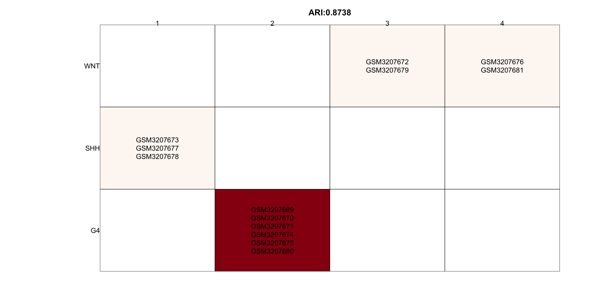

## Network Construction

The purpose of this part:

**create a gene regulatory network from transcriptome dataset**.

No "lazy mode" function available for this part. The most important function here is : `SJAracne.prepare()`, user could directly call this function if eset (an ExpressionSet class object), TF_list (list of transcription factor genes with ID match the main ID type in eset) and SIG_list (list of signaling factor genes with ID match the main ID type in eset) are well prepared. Others are mainly supporting functions for eset QC, ID conversion and etc. 

The complete step-by-step demo script for network construction can be found here, [pipeline_network_demo1.R](https://github.com/jyyulab/NetBID-dev/blob/master/demo_scripts/pipeline_network_demo1.R).

----------
## Quick Navigation for this page

- [Step 0: Preparations](#step-0-preparations)
- [Step 1: Load in gene expression datasets for network construction (exp-load)](#step-1-load-in-gene-expression-datasets-for-network-construction-exp-load)
   - [Q&A: The choice of expression dataset for network construction](#the-choice-of-expression-data-set-for-network-construction)
   - [Q&A: Input RNA-Seq dataset](#input-rna-seq-dataset)
   - [Q&A: Input expression matrix not from GEO database](#input-expression-matrix-not-from-geo-database)
- [Step 2: Normalization for the expression dataset (exp-QC)](#step-2-normalization-for-the-expression-dataset-exp-qc)
   - [Q&A: QC for RNA-Seq dataset](#qc-for-rna-seq-dataset)
   - [Q&A: Combine two datasets](#combine-two-datasets)
- [Step 3: Check sample cluster information, optional (exp-cluster)](#step-3-check-sample-cluster-analysis-optional-exp-cluster)
- [Step 4: Prepare files to run SJARACNe (sjaracne-prep)](#step-4-prepare-files-to-run-sjaracne-sjaracne-prep)
   - [Q&A: ID conversion](#id-conversion)
   
----------

## Step 0: Preparations
**Purpose: create an organized working directory for the network construction step in NetBID2 analysis.**

Make sure you have NetBID2 package. 

```R
library(NetBID2)
```

Create directories and folders to save and organize your analysis results.

We have designed a function `NetBID.network.dir.create()` to handle the working directories, so users can have a better data organization.
This function needs users to define the main working directory `project_main_dir` and the project’s name `project_name`. 
To prevent previous project with the same `project_main_dir` and `project_name` from being rewrite, it is highly suggested to add a time tag to your `project_name`.

```R
# Define main working directory and project name
project_main_dir <- './test' # user defined main directory for the project, one main directory could have multiple project folders, distinguished by project name.
current_date <- format(Sys.time(), "%Y-%m-%d") # optional, if user like to add current date to name the project folder
project_name <- sprintf('project_%s',current_date) # project name for the project folders under main directory.
```

`NetBID.network.dir.create()` creates a main working directory with a subdirectory of the project. 
It also automatically creates three subfolders (QC, DATA and SJAR) within the project folder. 
QC/, storing Quality Control related plots; DATA/, saving data in RData format; SJAR/, storing files needed for running SJAracne [SJARACNe](https://github.com/jyyulab/SJARACNe). 
It also returns a list object, here named `network.par` with directory information wrapped inside. 
This list is an ESSENTIAL varaible for network construction, all the important intermediate data generated later on will be wrapped inside.
If the current environment already has this variable, the function will only report a warning message and return the existed `network.par`.  

```R
# Create a hierarchcial working directory and return a list contains the hierarchcial working directory information
# This list object (network.par) is an ESSENTIAL variable in network construction pipeline
network.par  <- NetBID.network.dir.create(project_main_dir=project_main_dir,project_name=project_name)
```

## Step 1: Load in gene expression datasets for network construction (exp-load)
**Purpose: download the target expression profile and perform quality control analysis on the raw data.**

Here, we use `GSE116028` microarray data from GEO as the demo dataset. (Check [***The choice of expression dataset for network construction***](#the-choice-of-expression-data-set-for-network-construction) for more details). 
Given the ID of GSE (GEO series) and GPL (GEO platform), `load.exp.GEO()` will download the corresponding expression dataset from GEO database.
The data will be saved as [eSet](https://www.rdocumentation.org/packages/Biobase/versions/2.32.0/topics/ExpressionSet) class object in the environment, and will also be saved as RData in the `out.dir` folder.
To download gene annotation file, one need to set `getGPL=TRUE`. 
To prevent repetitive download instead of updating, one need to set `update=FALSE`, so `load.exp.GEO()` will reload the existed RData (in this demo, RData will be reload from `DATA/GSE116028_GPL6480.RData`) directly.

```R
# Download expression dataset from GEO, need to provide GSE ID and GPL ID
net_eset <- load.exp.GEO(out.dir=network.par$out.dir.DATA,GSE='GSE116028',GPL='GPL6480',getGPL=TRUE,update=FALSE)
```

*Optional:*
Directly looking at the probe expression value from the raw expression dataset is not much meaningful.
`update_eset.feature()` allows users to reassign the featureData slot of ExpressionSet object based on user’s demand. For example, from probe IDs to gene IDs.
Given the conversion table `use_feature_info`, `from_feature` and `to_feature`, this function will convert old IDs into new IDs using `merge_method`.

```R
# ID conversion, or merge transcript level to expression level, use_feature_info can be other dataframe instead of fData; optional;
net_eset <- update_eset.feature(use_eset=net_eset,use_feature_info=fData(net_eset),from_feature='ID',to_feature='GENE_SYMBOL',merge_method='median')
```

*Optional:*
Users can use `update_eset.phenotype()` to extract interested phenotype information from phenoData slot of ExpressionSet object, and update it.
Use `use_col` to tell the function which column(s) in `use_phenotype_info` to keep. If set to `auto`, it only extracting "cluster-meaningful" sample features (e.g. it is meaningless to use "gender"" as clustering feature, if all samples are female).
If set to `GEO-auto`, it will extract columns: "geo_accession"", "title", "source_name_ch1" and columns names ended with ":ch1".

```R
# Select phenotype columns or user added phenotype info; optional
net_eset <- update_eset.phenotype(use_eset=net_eset,use_phenotype_info=pData(net_eset),use_sample_col='geo_accession',use_col='GEO-auto')
```

**Now, wrap this ExpressionSet object `net_eset` into the ESSENTIAL variable `network.par`.**

```R
# Add the variable into network.par. ESSENTIAL STEP.
network.par$net.eset <- net_eset
```

**Perform quality control for the raw ExpressionSet object.**
Call `draw.eset.QC()`, an HTML report containing quality control analysis plots will be created. 
Users can choose interested phenotype information from phenoData slot to do this quality control, by assigning value to `intgroup`. 
If `intgroup` is NULL, all the columns from phenoData slot will be used.
The HTML created by `draw.eset.QC()` is using pandoc. Please make sure you have it installed.
Checking the availability of pandoc, one can call `pandoc_available()`.
Installing and setting the environment for pandoc, one can call `Sys.setenv(RSTUDIO_PANDOC=$installed_path)`, here replace `$installed_path` with the installed path of pandoc. If pandoc not available, users could set `generate_html=FALSE` and plots in pdf format will be generated. 

```R
# QC for the raw eset
draw.eset.QC(network.par$net.eset,outdir=network.par$out.dir.QC,intgroup=NULL,do.logtransform=FALSE,prefix='beforeQC_',
             pre_define=c('WNT'='blue','SHH'='red','G4'='green'),pca_plot_type='2D.interactive')
```

**- What information can you get from the HTML QC report?**  ([before_QC.html](beforeQC_QC.html))
  - A table. It contains phenotype information of samples. Descriptive variables, such as number of samples and genes (probes/transcripts/...);
  - A heatmap and a PCA biplot. All samples will be clustered using the raw expression values across all the genes as features. The aim of this is to check possible mis-labeled samples and the occurrence of batch effects; 
  - A correlation plot for all sample pairs. This helps to check the correlation within group and between groups. 
  - A density plot. It shows the range and the distribution of the expression values. This also helps to judge if the original dataset has been log transformed;


Now, the basic pre-processing steps are done for the raw data. 
For persistent storage of data, and prevent the re-run of all previous steps. Users can checkout and save `network.par` as RData for this part.
The function `NetBID.saveRData()` provide easier pipeline step checkout and reference. 
Giving pipeline step name to `step`, the `network.par` will be saved with step name as `network.par$out.dir.DATA/network.par.Step.{exp-load}.RData`.

```R
# Save Step 1 network.par as RData
NetBID.saveRData(network.par = network.par,step='exp-load')
```

----------
### *The choice of expression data set for network construction*

- For a NetBID2 project, users need to decide what expression dataset to use for starting their biological story.
Here are some important factors need to be considered, when using the expression dataset to construct regulatory network.

   - The reasoning of using expression dataset to infer gene regulatory network is based on [SJARACNe](https://academic.oup.com/bioinformatics/advance-article/doi/10.1093/bioinformatics/bty907/5156064). 
   It uses the information-theoretic approach to eliminate the majority of indirect interactions inferred by co-expression methods. The more samples, the higher sensitivity and precision.
   Typically, more than 100 samples is recommended. 
   - Large size public datasets from the same tissue, cell line or biological background are recommended to use as the expression datasets. Users can search through public databases, such as [GEO](#the-choice-of-expression-dataset-for-network-construction) and [TCGA](#https://portal.gdc.cancer.gov). 
   - Computationally inferred networks cannot avoid to have false positive edges. Especially for edges with relatively low mutual information (MI) scores. Functional interpretation from the regulatory network will be explained in the [Driver estimation](../docs/driver_estimation) part. 

- In real-world practice, the demo's expression dataset is too small to construct a high quality network. However, it provides a handy visualization for the procedure of the NetBID2.

----------

### *Input RNA-Seq dataset*   

- NetBID2 provides two functions to load expression dataset from RNA-Seq, `load.exp.RNASeq.demo()` and `load.exp.RNASeq.demoSalmon()`. 
**BUT** these two function are still in demo version, and don't support the complicated options in `tximport()` and `DESeq()`. 
It's challenging due to the various output format from RNA-Seq (e.g. using different reference genomes). We suggest to use those well-developped tools in this case.

- If users like to try `load.exp.RNASeq.demo()` and `load.exp.RNASeq.demoSalmon()`, be aware to the `return_type` in these functions. 
    - 'txi' is the output of `tximport()`. It is a list containing three matrices, abundance, counts and length. "counts" is the matrix of raw count.
    - 'counts' is the matrix of raw count.
    - 'tpm' is the raw tpm.
    - 'fpm', 'cpm' is the fragments/counts per million mapped fragments.
    - 'raw-dds' is the DESeqDataSet class object, which is the original one without processing.
    - 'dds' is the DESeqDataSet class object, which is processed by `DESeq()`.
    - 'eset' is the ExpressionSet class object, which is processed by `DESeq()` and `vst()`.
    
    Default is 'tpm'. If users don't choose 'eset' as return type. The output object cannot be directly used in the rest pipeline so far. 
    Please check the ***Input expression matrix not from GEO database*** section to see how to proceed.

----------
### *Input expression matrix not from GEO database*   
- If users have expression matrix not obtained from GEO database. They still can prepared the ExpressionSet class object using `generate.eset()`.

For example, RNA-Seq dataset processed into TPM (transcripts per million).
```R
#tpm <- load.exp.RNASeq.demo(XXX)
tmp_mat  <- log2(tpm)
tmp_eset <- generate.eset(exp_mat = tmp_mat, phenotype_info = NULL,feature_info = NULL, annotation_info = "")
```
Some details of `generate.eset()`:
it generates ExpressionSet class object to contain and describe the high-throughput assays;
Users can define its slots, which are expression matrix (required), phenotype information and feature information (optional);
If `phenotype_info = NULL`, a column named with 'group' will be automatically generated;
If `feature_info = NULL`, a column named with 'gene' will be automatically generated. 

----------

## Step 2: Normalization for the expression dataset (exp-QC)
**Purpose: normalize the expression data and perform quality control analysis on the normalized data.**

Please skip the following line if you didn't close R session after completed Step 1.

Don't skip, if you have checked out and closed R session after completed the Step 1. Before start Step 2, please reload `network.par` RData from Step 1.
`NetBID.loadRData()` reloads RData saved by `NetBID.saveRData()`. It prevents user from repeating former pipeline steps.
If the re-opened R session doesn't have `network.par` in the environment, please comment off the first two command lines. It will create a temporary `network.par`
with path of the saved Step 1 RData, `network.par$out.dir.DATA`. The path `test//project_2019-05-02//DATA/` here is just an example, 
users need to give their own path used to save `network.par` RData from Step 1.

```R
# Reload network.par RData from Step 1
#network.par <- list()
#network.par$out.dir.DATA <- 'test//project_2019-05-02//DATA/'
NetBID.loadRData(network.par = network.par,step='exp-load')
```

The following QC steps are highly suggested for **microarray** dataset, but not essential.

**First, the handling of missing data.**

Count the number of `NA` values for each sample and each gene (or probes/transcripts/...). 
If one sample or gene has too many `NA` values, user can choose to remove that sample or gene, or perform imputation by using `impute.knn()`. 

```R
# Get the expression matrix from ExpressionSet object
mat <- exprs(network.par$net.eset)
# Count and show number of NAs across samples and genes
sample_na_count <- apply(mat,1,function(x){length(which(is.na(x)==TRUE))})
print(table(sample_na_count))
gene_na_count <- apply(mat,2,function(x){length(which(is.na(x)==TRUE))})
print(table(gene_na_count))
# Perform imputation
if(sum(sample_na_count)+sum(gene_na_count)>0) mat <- impute.knn(mat)$data
```

**Second, the log2 transformation.**

Sometimes it is hard to know whether the raw dataset has been log2-transformed or not. 
Here, we use a threshold from experience to check the median value. It may not be suitable for all cases, users can modify the threshold based on their own experience.

```R
# Perform log2 transformation
med_val <- median(apply(mat,2,median)); print(med_val)
if(med_val>16){mat <- log2(mat)}
```

**Third, the quantile normalization across samples.**

This is suggested for dealing with microarray dataset, but not for RNA-Seq or log2tpm etc.  

```R
# Perform limma quantile normalization
mat <- normalizeQuantiles(mat) 
```

**Fourth, filter out genes with very low expression values (bottom 5%) in most samples (more than 90%).**

The presence of low-expression genes are less informative for network construction. 

```R
# Filter out low-expression genes
choose1 <- apply(mat<= quantile(mat, probs = 0.05), 1, sum)<= ncol(mat) * 0.90
print(table(choose1))
mat <- mat[choose1,]
```

Now, the expression matrix has been updated. Users need to wrap it into the ExpressionSet class object, so it can be used for later pipeline studies.
`generate.eset()` is designed to create the ExpressionSet object when only expression matrix is available.
Users can also update the `network.par$net.eset`, and generate the HTML QC report to the normalized data, and save it as RData.
Please use `draw.eset.QC()` to create QC report and `NetBID.saveRData()` to save the normalized `network.par`. 

```R
# Update eset with normalized expression matrix
net_eset <- generate.eset(exp_mat=mat, phenotype_info=pData(network.par$net.eset)[colnames(mat),],
                          feature_info=fData(network.par$net.eset)[rownames(mat),],
                          annotation_info=annotation(network.par$net.eset))
# Updata network.par with new eset
network.par$net.eset <- net_eset
# QC for the normalized eset
draw.eset.QC(network.par$net.eset,outdir=network.par$out.dir.QC,intgroup=NULL,do.logtransform=FALSE,prefix='afterQC_',
             pre_define=c('WNT'='blue','SHH'='red','G4'='green'),pca_plot_type='2D.interactive')
# Save Step 2 network.par as RData
NetBID.saveRData(network.par = network.par,step='exp-QC')
```

**- What information can you get from the HTML QC report after QC steps?** ([after_QC.html](afterQC_QC.html))
  - A table. Compare the table with the one in Step 1. To see if a large amount of genes/samples has been removed;
  - A heatmap and a PCA biplot. All samples will be clustered using the normalized expression values across all the genes as features. The aim of this is to check possible mis-labeled samples;
  - A correlation plot for all sample pairs. This helps to check the correlation within group and between groups. 
  - A density plot. Compare the table with the one in Step 1. To see if the low expressed genes have been removed;


----------
### *QC for RNA-Seq dataset*  
- QC Step 1 to Step 3 are not suitable for RNA-Seq dataset, regardless of their pre-processing strategies. Only QC Step 4, "removing low expressed genes" is suggested to perform.
For example, if one uses `load.exp.RNASeq.demo()` or `load.exp.RNASeq.demoSalmon()` with settings of `dds` or `eset`. There is no need for normalization.
- If one uses the raw count data as the expression matrix, he can call `RNASeqCount.normalize.scale()` to perform normalizaiton, which is followed by "log2 transformation".
- If one uses the FPKM (Fagments Per Kilobase Million), TPM (Transcripts Per Million), CPM (Counts Per Million), the "log2 transformation" from QC Step 2 is suggested.
- The quality control analysis is different from case to case, NetBID2 only provides functions and tools to faciliate users to make their own decisions. Following the calling softwares' pipeline is strongly suggested.

----------
### *Combine two datasets*  
- To combine two expression datasets, please call `merge_eset()`. 
- If the two expression datasets come from the same platform and contain the same gene list, no Z-transformation will be performed. 
Otherwise, Z-transformation is suggested to be performed before combining these two datasets.
- The merged ExpressionSet class object will include a new phenotype column set by `group_col_name`, this column is used to distinguish each sample's original dataset. 
- No batch effect will be removed during combination by default. It is strongly suggested to check the sample clustering results before trying to remove the batch (User could follow the pipeline in the following Step 3). Generally, batch effect exists for microarray dataset but not for RNA-Seq dataset with the same protocal. 

----------

## Step 3: Check sample cluster analysis, optional (exp-cluster)
**Purpose: check if the highly variable genes can be used to perform good sample cluster analysis (predicted labels vs. real labels).**
This step is not necessary to perform NetBID2. Just create plots for visualization, no modification to the data.

Please skip the following line if you didn't close R session after completed Step 1 and Step 2.

Don't skip, if you have checked out and closed R session after completed the Step 1 and Step 2. Before start Step 3, please reload `network.par` RData from Step 2.
`NetBID.loadRData()` reloads RData saved by `NetBID.saveRData()`. It prevents user from repeating former pipeline steps.
If the re-opened R session doesn't have `network.par` in the environment, please comment off the first two command lines. It will create a temporary `network.par`
with path of the saved Step 1 RData, `network.par$out.dir.DATA`. The path `test//project_2019-05-02//DATA/` here is just an example, 
users need to give their own path used to save `network.par` RData from Step 2.

```R
# Reload network.par RData from Step 2
#network.par <- list()
#network.par$out.dir.DATA <- 'test//project_2019-05-02//DATA/'
NetBID.loadRData(network.par = network.par,step='exp-QC')
```

**Select the most variable genes across samples using `IQR.filter()` to perform sample cluster analysis.**
IQR (interquartile range) is a measure of statistical dispersion. It is calculated for each gene across all the samples. 
`IQR.filter` extract top 50% variable genes from the expression matrix by setting `thre` to 0.5. 
Users can also set a list of interested genes `loose_gene` to pass a less stringent filter, by setting a looser threshold value to `loose_thre`.

```R
# Select the most variable genes across samples
mat <- exprs(network.par$net.eset)
choose1 <- IQR.filter(exp_mat=mat,use_genes=rownames(mat),thre = 0.5)
print(table(choose1))
mat <- mat[choose1,]
```

**To have a taste of how IQR filtered genes will affect the cluster analysis of samples.**
Wrap the filtered genes into a temporary ExpressionSet object and create a HTML QC report. [Cluster_QC.html](Cluster_QC.html)

```R
# Generate temporary eset
tmp_net_eset <- generate.eset(exp_mat=mat, phenotype_info=pData(network.par$net.eset)[colnames(mat),],
                          feature_info=fData(network.par$net.eset)[rownames(mat),], annotation_info=annotation(network.par$net.eset))
# QC plot for IQR filtered eset
draw.eset.QC(tmp_net_eset,outdir=network.par$out.dir.QC,intgroup=NULL,do.logtransform=FALSE,prefix='Cluster_',
             pre_define=c('WNT'='blue','SHH'='red','G4'='green'),pca_plot_type='2D.interactive')
```

The following scripts provide various ways to visualize and check if the IQR filter selected genes can be used to perform good sample cluster analysis (observed labels vs. predicted labels). 
Figures will be displayed instead of saving as files.

**First, extract "cluster-meaningful" phenotype columns.**

Each column of the phenotype information data frame `pData(network.par$net.eset)` can contain certain categories.
For example, the "gender" column in the phenotype data frame, it has two categories, "Male" and "Female". This categorial information gives the observed labels to samples.
If users don't know which phenotype columns to extract, `get_int_group` will extract all "cluster-meaningful" phenotype columns from the ExpressionSet object.
For example, if "gender" column only contains "Female", it is meaningless to extract is to do cluster analysis, cause all samples will be clustered as one.
Another example, if all samples have differnet age, it is meaningless to extract "age" column, cause all samples will be grouped separately.

```R
# Extract phenotype information data frame from eset
phe <- pData(network.par$net.eset)
# Extract all "cluster-meaningful" phenotype columns
intgroup <- get_int_group(network.par$net.eset)
```

**Second, perform clustering analysis on all "cluster-meaningful" phenotype columns and draw plots.**
for each phenotype column in the `intgroup`, user can choose `draw.pca.kmeans()` or `draw.umap.kmeans()` to cluster samples and visualize the result between the observed label vs. the predicted label. The clustering is performed by K-means, and the result can be plotted using PCA biplot or UMAP (Uniform Manifold Approximation and Projection). 
User can also choose another clustering method, [MICA](https://github.com/jyyulab/scMINER/tree/master/MICA), by calling `draw.MICA()`. 
All three functions can either return the K-value yielding the optimal result (setting `return_type='optimal'`), or all the K-values (setting `return_type='all'`) used for clustering. 

```R
# Cluster analysis using Kmeans and plot result using PCA biplot (pca+kmeans in 2D)
for(i in 1:length(intgroup)){
  print(intgroup[i])
  pred_label <- draw.pca.kmeans(mat=mat,all_k = NULL,obs_label=get_obs_label(phe,intgroup[i]),pre_define=c('WNT'='blue','SHH'='red','G4'='green'))
}
```

**Here, we pick the `subgroup` column from the demo's phenotype data frame as an example, to show various visualization tools NetBID2 can provide.**
`get_obs_label()` returns a vector of selected phenotype descriptive information for each sample.

```R
use_int <- 'subgroup'
pred_label <- draw.pca.kmeans(mat=mat,all_k = NULL,obs_label=get_obs_label(phe,use_int),plot_type='2D',pre_define=c('WNT'='blue','SHH'='red','G4'='green'))
```


Above is a side-by-side basic scatter plot of samples. The categories of observed labels (left figure) and predicted labels (right figure) are distinguished by color.
The calculated statistics on top of the right figure quantifies the similarity between observed labels predicted labels. 
ARI is short for "adjusted rand index", ranges from 0 to 1. Higher ARI value indicates higher similarity. For details, please check `get_clustComp()`. 

```R
pred_label <- draw.pca.kmeans(mat=mat,all_k = NULL,obs_label=get_obs_label(phe,use_int),plot_type='2D.ellipse',pre_define=c('WNT'='blue','SHH'='red','G4'='green'))
```


Above is a side-by-side scatter plot with an ellipse drawn around each cluster of samples. Each ellipse is marked with its cluster label.

```R
pred_label <- draw.pca.kmeans(mat=mat,all_k = NULL,obs_label=get_obs_label(phe,use_int),plot_type='3D',pre_define=c('WNT'='blue','SHH'='red','G4'='green'))
```


Above is a side-by-side scatter plot in 3D. Here, we use the first three principle component as axises.

```R
print(table(list(pred_label=pred_label,obs_label=get_obs_label(phe, use_int))))
draw.clustComp(pred_label,obs_label=get_obs_label(phe,use_int),outlier_cex=1,low_K=10) 
```



Above is a table to visualize each sample’s observed label vs. its predicted label, it shows more details. 
The darker the table cell is, the more samples are gathered in the corresponding label. We can see 4 WNTs can be further separated into two sub-groups.
However, in this demo dataset, no obvious outlier samples are observed. 

```R
draw.pca.kmeans(mat=mat,all_k = NULL,obs_label=get_obs_label(phe,use_int),
                plot_type='2D.interactive',
                pre_define=c('WNT'='blue','SHH'='red','G4'='green'))
```

<iframe width="600" height="400" frameborder="0" scrolling="no" src="interactive.html"></iframe> 

Above is the interactive plot, user could mouse over to check the sample label for each points.
The text for each point is organized as "sample_name:observed_label:predicted_label".
The color to the points are categorized by the observed label and the shape by the predicted label.

If user found an outlier sample and removed it, we suggest to re-run Step 2 and Step 3 to see whether the data got cleaner after the remove of outlier.


## Step 4: Prepare files to run SJARACNe (sjaracne-prep)
**Purpose: download SJARACNe needed database to local folders and prepare files to run SJARACNe.**

Please skip the following line if you didn't close R session after completed Step 1 and Step 2 (doesn't matter if you runned Step 3 or not).

Don't skip, if you have checked out and closed R session after completed the Step 1 and Step 2. Before start Step 4, please reload `network.par` RData from Step 2.
`NetBID.loadRData()` reloads RData saved by `NetBID.saveRData()`. It prevents user from repeating former pipeline steps.
If the re-opened R session doesn't have `network.par` in the environment, please comment off the first two command lines. It will create a temporary `network.par`
with path of the saved Step 1 RData, `network.par$out.dir.DATA`. The path `test//project_2019-05-02//DATA/` here is just an example, 
users need to give their own path used to save `network.par` RData from Step 2.

```R
# Reload network.par RData from Step 2
#network.par <- list()
#network.par$out.dir.DATA <- 'test//project_2019-05-02//DATA/'
NetBID.loadRData(network.par = network.par,step='exp-QC')
```

**First, use `db.preload()` to download the transcription facotrs (TF) list and signaling factors (SIG) list, with species and level defined.**

For the TF and SIG list, NetBID2 has `external_gene_name` and `ensembl_gene_id` ID type files for human and mouse embedded in the package. (e.g. `MOUSE_SIG_ensembl_gene_id.txt` in `system.file(package = "NetBID2")/db/`). To use these files, just set `TF_list=NULL` or `SIG_list=NULL`. If users would like to use their own list, please pass them to `TF_list=NULL` or `SIG_list=NULL`. 

For the species and level, NetBID2 has prepared both "gene-level"" and "transcript-level" RData for human by default. If the target species is not human, user can set `use_spe` to target species, and `db.preload()` will prepare that species database. 

For the storage of downloaded data, if user leaves `main.dir=NULL`, the RData will be saved automatically to `system.file(package = "NetBID2")/db/`. 
If NetBID2 is installed in a public place and user doesn't have the root permissions, one can set `main.dir` to another path with permission. 
And please make sure to use the same path for the further analysis.

```R
# Load database
db.preload(use_level='gene',use_spe='human',update=FALSE)
```

**Second, converts gene ID into the corresponding TF/SIG list, with selected gene/transcript type.**
Users can set `use_gene_type` in the function `get.TF_SIG.list()` to pick the attribute name to convert to.
Options are, "ensembl_gene_id", "ensembl_gene_id_version", "ensembl_transcript_id", "ensembl_transcript_id_version" and "refseq_mrna".
For details, please check [***ID conversion***](#id-conversion) section below.
Conversion is *not required*, if user can get the `TF_list` and `SIG_list` with the same ID type as in the expression matrix. 
In this case, users can jump to the final step to call `SJAracne.prepare()`.


```R
# Converts gene ID into the corresponding TF/SIG list
use_gene_type <- 'external_gene_name' # user-defined
use_genes <- rownames(fData(network.par$net.eset))
use_list  <- get.TF_SIG.list(use_genes,use_gene_type=use_gene_type)
```

**Last, use `SJAracne.prepare()` to prepare files for running SJARACNe.**

For sample selection: user can choose to use all the samples or some of them. Here we use all the samples.
For creating multiple networks: user can set `prj.name` for easier reference. For example, if user wants to create Group4 specific network using Group4 samples. Just specify `use.samples` 
and `prj.name = 'Group4_net'`. This `prj.name` setting is important for the [Driver estimation](../driver_estimation) part. 
For other parameters: the `IQR.thre` and `IQR.loose_thre` will be passed to `IQR.filter()`. The `loose_gene` will be the genes in `TF_list` and `SIG_list`, which pre-defined as the possible drivers during network construction.
For output file size: here in the demo, in order to control the file size, we set `IQR.thre=0.9` and `IQR.loose_thre=0.7`. However, in real practice, `IQR.thre=0.5` and `IQR.loose_thre=0.1` is recommended.

```R
# Select samples for analysis
phe <- pData(network.par$net.eset)
use.samples <- rownames(phe) # here is using all samples, users can modify
prj.name <- network.par$project.name # if use different samples, need to change the project name
SJAracne.prepare(eset=network.par$net.eset,use.samples=use.samples,
                    TF_list=use_list$tf,SIG_list=use_list$sig,
                    IQR.thre = 0.5,IQR.loose_thre = 0.1,
                    SJAR.project_name=prj.name,SJAR.main_dir=network.par$out.dir.SJAR)
```

Due to the memory consumption and speed computational capability, SJARACNe will handle the network construction, please follow the github tutorial to run [SJARACNe](https://github.com/jyyulab/SJARACNe).

----------
### *ID conversion*  

We use the ID conversion tools from [biomaRt](https://bioconductor.org/packages/release/bioc/vignettes/biomaRt/inst/doc/biomaRt.html).
The ID names with different types (e.g gene symbols) or ID related attributes (e.g gene biotype) in biomaRt package, are the values we are interested in to retrieve.
The commonly used ID types are "external_gene_name","ensembl_gene_id", "ensembl_gene_id_version", "ensembl_transcript_id", "ensembl_transcript_id_version" and "refseq_mrna". 
The listAttributes() function displays all available attributes in the selected dataset.

**ATTENTION** 
- biomaRt will use the newest version number of [GENCODE](https://www.gencodegenes.org). Since all the ID conversion related functions `db.preload()`, `get.TF_SIG.list()`, `get_IDtransfer()`, `get_IDtransfer2symbol2type()` and `get_IDtransfer_betweenSpecies()` will access the archived database through website link, the version number of ensembl ID may vary from different runs. Users can set `ignore_version=TRUE` to ignore the version number for ensembl IDs. 
- Functions like, `get_IDtransfer()`, `get_IDtransfer2symbol2type()` and `get_IDtransfer_betweenSpecies()` can generate the conversion table for `get_name_transfertab()`. 
However, users can choose to use their own curated one.
