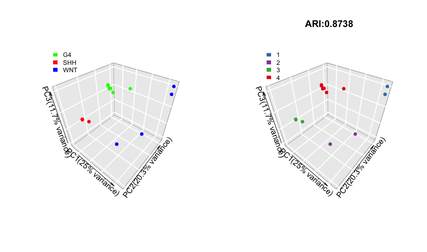

## Network reconstruction

The purpose of this part is to

**create a gene regulatory network from the transcriptome dataset**.

No "lazy mode" function is available for this part. The most important function here is  `SJAracne.prepare()`. The user can call this function directly if eSet (an ExpressionSet class object), TF_list (the list of transcription factor genes with ID match to the main ID type in eSet) and SIG_list (the list of signaling factor genes with ID match to the main ID type in eSet) are well prepared. Other functions are mainly supporting functions for eSet QC, ID conversion, etc. 

The complete step-by-step demo script for network reconstruction can be found here: [pipeline_network_demo1.R](https://github.com/jyyulab/NetBID-dev/blob/master/demo_scripts/pipeline_network_demo1.R).

----------
## Quick Navigation for this page

- [Step 0: Preparations](#step-0-preparations)
- [Step 1: Load gene expression datasets for network reconstruction (exp-load)](#step-1-load-gene-expression-datasets-for-network-reconstruction-exp-load)
   - [Q&A: The choice of expression dataset for network reconstruction](#the-choice-of-expression-data-set-for-network-reconstruction)
   - [Q&A: Input RNA-Seq dataset](#input-rna-seq-dataset)
   - [Q&A: Input expression matrix not from the GEO database](#input-expression-matrix-not-from-the-geo-database)
- [Step 2: Normalization for the expression dataset (exp-QC)](#step-2-normalization-for-the-expression-dataset-exp-qc)
   - [Q&A: QC for an RNA-Seq dataset](#qc-for-an-rna-seq-dataset)
   - [Q&A: Combining two datasets](#combining-two-datasets)
- [Step 3: Check sample cluster information (optional) (exp-cluster)](#step-3-check-sample-cluster-analysis-optional-exp-cluster)
- [Step 4: Prepare files to run SJARACNe (sjaracne-prep)](#step-4-prepare-files-to-run-sjaracne-sjaracne-prep)
   - [Q&A: ID conversion](#id-conversion)
   
----------

## Step 0: Preparations
**Purpose: Create an organized working directory for the network reconstruction step in NetBID2 analysis.**

Make sure you have the NetBID2 package. 

```R
library(NetBID2)
```

Create directories and folders to save and organize your analysis results.

We have designed a function, `NetBID.network.dir.create()` to handle the working directories so that the user can have a better data organization.
This function require user to define the main working directory `project_main_dir` and the project name `project_name`. 
To prevent a previous project with the same `project_main_dir` and `project_name` from being rewritten, it is strongly suggested that you add a time tag to your `project_name`.

```R
# Define main working directory and project name
project_main_dir <- './test' # user defined main directory for the project, one main directory could have multiple project folders, distinguished by project name.
current_date <- format(Sys.time(), "%Y-%m-%d") # optional, if user like to add current date to name the project folder
project_name <- sprintf('project_%s',current_date) # project name for the project folders under main directory.
```

`NetBID.network.dir.create()` creates a main working directory with a subdirectory for the project. 
It also automatically creates three subfolders (QC, DATA and SJAR) within the project folder:
QC/, storing quality control related plots; DATA/, saving data in RData format and SJAR/, storing files needed for running SJAracne [SJARACNe](https://github.com/jyyulab/SJARACNe). 
It also returns a list object, here named `network.par`, with directory information wrapped inside. 
This list is an ESSENTIAL variable for network reconstruction: all of the important intermediate data generated later on will be wrapped inside.
If the current environment already has this variable, the function will only report a warning message and return the existing `network.par`.  

```R
# Create a hierarchical working directory and return a list contains the hierarchical working directory information
# This list object (network.par) is an ESSENTIAL variable in network reconstruction pipeline
network.par  <- NetBID.network.dir.create(project_main_dir=project_main_dir,project_name=project_name)
```

## Step 1: Load gene expression datasets for network reconstruction (exp-load)
**Purpose: Download the target expression profile and perform quality control analysis on the raw data.**

Here, we use `GSE116028` microarray data from GEO as the demo dataset. (See [***The choice of expression dataset for network reconstruction***](#the-choice-of-expression-data-set-for-network-reconstruction) for more details). 
Given the ID of GSE (GEO series) and GPL (GEO platform), `load.exp.GEO()` will download the corresponding expression dataset from the GEO database.
The data will be saved as an [eSet](https://www.rdocumentation.org/packages/Biobase/versions/2.32.0/topics/ExpressionSet) class object in the environment, and will also be saved as RData in the `out.dir` folder.
To download a gene annotation file, set `getGPL=TRUE`. 
To prevent repetitive downloading instead of updating, set `update=FALSE`, so that `load.exp.GEO()` will reload the existing RData directly. (In this demo, RData will be reloaded from `DATA/GSE116028_GPL6480.RData`).

```R
# Download expression dataset from GEO, need to provide GSE ID and GPL ID
net_eset <- load.exp.GEO(out.dir=network.par$out.dir.DATA,GSE='GSE116028',GPL='GPL6480',getGPL=TRUE,update=FALSE)
```

*Optional:*
Directly looking at the probe expression value from the raw expression dataset is not very meaningful.
`update_eset.feature()` allows the user to reassign the featureData slot of the ExpressionSet object based on the user’s demand. For example, from probe IDs to gene IDs.
Given the conversion table `use_feature_info`, `from_feature` and `to_feature`, this function will convert old IDs into new IDs by using `merge_method`.

```R
# ID conversion, or merge transcript level to expression level, use_feature_info can be other dataframe instead of fData; optional;
net_eset <- update_eset.feature(use_eset=net_eset,use_feature_info=fData(net_eset),from_feature='ID',to_feature='GENE_SYMBOL',merge_method='median')
```

*Optional:*
The user can use `update_eset.phenotype()` to extract information on a phenotype of interest from the phenoData slot of the ExpressionSet object and update it.
Use `use_col` to tell the function which column(s) in `use_phenotype_info` to keep. If set to `auto`, the function extract only "cluster-meaningful" sample features (e.g, it is meaningless to use "gender" as a clustering feature, if all samples are female).
If set to `GEO-auto`, the function will extract the columns: "geo_accession", "title", "source_name_ch1" and columns with names ending in ":ch1".

```R
# Select phenotype columns or user added phenotype info; optional
net_eset <- update_eset.phenotype(use_eset=net_eset,use_phenotype_info=pData(net_eset),use_sample_col='geo_accession',use_col='GEO-auto')
```

**Now, wrap this ExpressionSet object `net_eset` into the ESSENTIAL variable `network.par`.**

```R
# Add the variable into network.par. ESSENTIAL STEP.
network.par$net.eset <- net_eset
```

**Perform quality control for the raw ExpressionSet object.**
Call `draw.eset.QC()` and an HTML report containing quality control analysis plots will be created. 
The user can choose information on a phenotype of interest from the phenoData slot to perform this quality control by assigning a value to `intgroup`. 
If `intgroup` is NULL, all of the columns from the phenoData slot will be used.
The HTML created by `draw.eset.QC()` uses pandoc. Please make sure that you have it installed.
To check the availability of pandoc, you can call `pandoc_available()`.
To install and set the environment for pandoc, you can call `Sys.setenv(RSTUDIO_PANDOC=$installed_path)`;here replace `$installed_path` with the installed path of pandoc. If pandoc not available, the user could set `generate_html=FALSE` and plots in pdf format will be generated. 

```R
# QC for the raw eset
draw.eset.QC(network.par$net.eset,outdir=network.par$out.dir.QC,intgroup=NULL,do.logtransform=FALSE,prefix='beforeQC_',
             pre_define=c('WNT'='blue','SHH'='red','G4'='green'),emb_plot_type='2D.interactive')
```

**- What information can you obtain from the HTML QC report?**  ([before_QC.html](beforeQC_QC.html))
  - A table. This contains phenotype information for samples. Descriptive variables, such as the number of samples and genes (probes/transcripts/etc.);
  - A heatmap and a PCA/MDS/UMAP biplot. All samples will be clustered using the raw expression values across all the genes as features. The aim of this is to check for mis-labeled samples and for the occurrence of batch effects; 
  - A correlation plot for all sample pairs. This helps to check the correlation within each group and between groups. 
  - A density plot. This shows the range and distribution of the expression values. It also helps the user to judge whether the original dataset has been log transformed;

Now, the basic pre-processing steps are performed for the raw data. 
For persistent storage of data and to prevent the re-running of all previous steps, the user can check out and save `network.par` as RData for this part.
The function `NetBID.saveRData()` provides an easier pipeline step to check out. 
By giving the pipeline step name to `step`, the `network.par` will be saved with the step name as `network.par$out.dir.DATA/network.par.Step.{exp-load}.RData`.

```R
# Save Step 1 network.par as RData
NetBID.saveRData(network.par = network.par,step='exp-load')
```

----------
### *The choice of expression data set for network reconstruction*

- For a NetBID2 project, the user needs to decide which expression dataset to use to begin their biological story.
Here are some important factors that need to be considered when using the expression dataset to construct a regulatory network.

   - The reason for using an expression dataset to infer a gene regulatory network is based on [SJARACNe](https://academic.oup.com/bioinformatics/advance-article/doi/10.1093/bioinformatics/bty907/5156064). 
   This uses the information-theoretic approach to eliminate most of the indirect interactions inferred by co-expression methods. The more samples, the higher the sensitivity and precision.
   Typically, more than 100 samples are recommended. 
   - It is recommended to use large size public datasets derived from the same tissue, cell line or biological background as the expression datasets. The user can search through public databases such as [GEO](#the-choice-of-expression-dataset-for-network-reconstruction) and [TCGA](#https://portal.gdc.cancer.gov). 
   - Computationally inferred networks cannot avoid having false-positive edges, especially for edges with relatively low mutual information (MI) scores. Functional interpretation of the regulatory network will be explained in the [Driver inference](../docs/driver_inference) section. 
- In real-world practice, the demo expression dataset would be too small to construct a high quality network. However, it provides a handy visualization of the NetBID2 procedure.

----------

### *Input RNA-Seq dataset*   

- NetBID2 provides two functions for loading an expression dataset derived from RNA-Seq, `load.exp.RNASeq.demo()` and `load.exp.RNASeq.demoSalmon()`. 
**HOWEVER** these two functions are still at the demo version stage and do not support the complicated options in `tximport()` and `DESeq()`. 
Including all options for RNA-Seq data processing is challenging because of the various output formats from RNA-Seq (e.g, using different reference genomes). Therefore, we suggest using the existing well-developed  tools in this case.

- If the user would like to try `load.exp.RNASeq.demo()` and `load.exp.RNASeq.demoSalmon()`, be aware of the `return_type` in these functions. 
    - 'txi' is the output of `tximport()`. It is a list containing three matrices, abundance, counts and length.
    - 'counts' is the matrix of the raw count.
    - 'tpm' is the raw tpm.
    - 'fpm' and 'cpm' are the fragments/counts per million mapped fragments.
    - 'raw-dds' is the DESeqDataSet class object, i.e., the original one without processing.
    - 'dds' is the DESeqDataSet class object, which is processed by `DESeq()`.
    - 'eSet' is the ExpressionSet class object, which is processed by `DESeq()` and `vst()`.
    
    The default is 'tpm'. If the user don't choose 'eset' as the return type. The output object cannot be used directly in the rest of the pipeline. 
    Please review the ***Input expression matrix not from the GEO database*** section to see how to proceed.

----------
### *Input expression matrix not from the GEO database*   
- If the user has expression matrix that was not obtained from the GEO database, they can still prepare the ExpressionSet class object by using `generate.eset()`.

For example, for an RNA-Seq dataset processed into TPM (transcripts per million).
```R
#tpm <- load.exp.RNASeq.demo(XXX)
tmp_mat  <- log2(tpm)
tmp_eset <- generate.eset(exp_mat = tmp_mat, phenotype_info = NULL,feature_info = NULL, annotation_info = "")
```
Some details of `generate.eset()`:
It generates an ExpressionSet class object to contain and describe the high-throughput assays.
The user can define its slots, which are expression matrix (required), phenotype information and feature information (optional);
If `phenotype_info = NULL`, a column named 'group' will be automatically generated;
If `feature_info = NULL`, a column named 'gene' will be automatically generated. 

----------

## Step 2: Normalization for the expression dataset (exp-QC)
**Purpose: Normalize the expression data and perform quality control analysis on the normalized data.**

Please skip the following line if you did not close R session after completing Step 1.

Do not skip the line if you have checked out of and closed R session after completing Step 1. Before starting Step 2, please reload the `network.par` RData from Step 1.
`NetBID.loadRData()` reloads RData saved by `NetBID.saveRData()`. This prevents the user from repeating the previous pipeline steps.
If the re-opened R session does not have `network.par` in the environment, please comment off the first two command lines. This will create a temporary `network.par`
with the path of the saved Step 1 RData, `network.par$out.dir.DATA`. The path `test//project_2019-05-02//DATA/` is used here only as an example, 
the user needs to provide their own path that they used to save the `network.par` RData from Step 1.

```R
# Reload network.par RData from Step 1
#network.par <- list()
#network.par$out.dir.DATA <- 'test//project_2019-05-02//DATA/'
NetBID.loadRData(network.par = network.par,step='exp-load')
```

The following QC steps are highly recommended for a **microarray** dataset, but they are not essential.

**1) Handling of missing data.**

Count the number of `NA` values for each sample and each gene (or probe/transcript/etc.). 
If one sample or gene has too many `NA` values, the user can choose to remove that sample or gene or to perform imputation by using `impute.knn()`. 

```R
# Get the expression matrix from ExpressionSet object
mat <- exprs(network.par$net.eset)
# Count and show number of NAs across samples and genes
sample_na_count <- apply(mat,1,function(x){length(which(is.na(x)==TRUE))})
print(table(sample_na_count))
gene_na_count <- apply(mat,2,function(x){length(which(is.na(x)==TRUE))})
print(table(gene_na_count))
# Perform imputation
if(sum(sample_na_count)+sum(gene_na_count)>0) mat <- impute.knn(mat)$data
```

**2) Log2 transformation.**

It is sometimes difficult to know whether the raw dataset has been log2-transformed. 
Here, we use a threshold derived from our experience to check the median value. It may not be suitable for all cases; the user can modify the threshold based on their own experience.

```R
# Perform log2 transformation
med_val <- median(apply(mat,2,median)); print(med_val)
if(med_val>16){mat <- log2(mat)}
```

**3) Quantile normalization across samples.**

This is recommended for dealing with a microarray dataset, but not for RNA-Seq or log2tpm, etc.  

```R
# Perform limma quantile normalization
mat <- normalizeQuantiles(mat) 
```

**4) Filtering out of genes with very low expression values (in the bottom 5%) in most samples (more than 90%).**

The presence of low-expression genes is less informative for network reconstruction. 

```R
# Filter out low-expression genes
choose1 <- apply(mat<= quantile(mat, probs = 0.05), 1, sum)<= ncol(mat) * 0.90
print(table(choose1))
mat <- mat[choose1,]
```

Now that the expression matrix has been updated, the user needs to wrap it into the ExpressionSet class object, so that it can be used for later pipeline studies.
`generate.eset()` is designed to create the ExpressionSet object when only an expression matrix is available.
The user can also update the `network.par$net.eset`, and generate the HTML QC report to the normalized data, and save it as RData.
Please use `draw.eset.QC()` to create the QC report and use `NetBID.saveRData()` to save the normalized `network.par`. 

```R
# Update eset with normalized expression matrix
net_eset <- generate.eset(exp_mat=mat, phenotype_info=pData(network.par$net.eset)[colnames(mat),],
                          feature_info=fData(network.par$net.eset)[rownames(mat),],
                          annotation_info=annotation(network.par$net.eset))
# Updata network.par with new eset
network.par$net.eset <- net_eset
# QC for the normalized eset
draw.eset.QC(network.par$net.eset,outdir=network.par$out.dir.QC,intgroup=NULL,do.logtransform=FALSE,prefix='afterQC_',
             pre_define=c('WNT'='blue','SHH'='red','G4'='green'),emb_plot_type='2D.interactive')
# Save Step 2 network.par as RData
NetBID.saveRData(network.par = network.par,step='exp-QC')
```

**- What information can you obtain from the HTML QC report after the QC steps?** ([after_QC.html](afterQC_QC.html))
  - A table. Compare the table with that in Step 1 to see whether a large amount of genes/samples has been removed;
  - A heatmap and a PCA/MDS/UMAP biplot. All samples will be clustered using the normalized expression values across all of the genes as features. The aim of this is to check for mis-labeled samples;
  - A correlation plot for all sample pairs. This helps to check the correlation within each group and between groups. 
  - A density plot. Compare the table with that in Step 1, to see whether the genes with low expression have been removed;


----------
### *QC for an RNA-Seq dataset*  
- QC Steps 1 to 3 are not suitable for an RNA-Seq dataset, regardless of their pre-processing strategies. It is recommended to perform only QC Step 4, "removing genes with low expression".
For example, if you use `load.exp.RNASeq.demo()` or `load.exp.RNASeq.demoSalmon()` with settings of `dds` or `eset`, there is no need for normalization.
- If you use the raw count data as the expression matrix, you can call `RNASeqCount.normalize.scale()` to perform normalization, which is followed by "log2 transformation".
- If you use the FPKM (Fragments  Per Kilobase Million), TPM (Transcripts Per Million), or CPM (Counts Per Million), the "log2 transformation" from QC Step 2 is recommended.
- The quality control analysis differs from case to case: NetBID2 provides only functions and tools to enable the user to make their own decisions. It is strongly recommended to follow the calling software pipeline.

----------
### *Combining two datasets*  
- To combine two expression datasets, please call `merge_eset()`. 
- If the two expression datasets come from the same platform and contain the same gene list, no Z-transformation will be performed. 
Otherwise, it is recommended to perform an Z-transformation before combining these two datasets.
- The merged ExpressionSet class object will include a new phenotype column named `group_col_name`. This column is used to distinguish the original dataset of each sample. 
- No batch effect will be removed during a combination by default. It is strongly recommended to check the sample clustering results before attempting to remove the batch (the user can follow the pipeline in Step 3 below). Generally, a batch effect exists for a microarray dataset but not for an RNA-Seq dataset processed with the same protocol. 

----------

## Step 3: Check sample cluster analysis (optional) (exp-cluster)
**Purpose: Check whether the highly variable genes can be used to perform good sample cluster analysis (predicted labels vs. real labels).**
This step is not necessary to perform NetBID2. It simply creates plots for visualization, with no modification of the data.

Please skip the following line if you did not close the R session after completing Steps 1 and 2.

Do not skip the line if you have checked out of and closed the R session after completing the Steps 1 and 2. Before starting Step 3, please reload the `network.par` RData from Step 2.
`NetBID.loadRData()` reloads RData saved by `NetBID.saveRData()`. This prevents the user from repeating the previous pipeline steps.
If the re-opened R session does not have `network.par` in the environment, please comment off the first two command lines. This will create a temporary `network.par`
with the path of the saved Step 1 RData, `network.par$out.dir.DATA`. The path `test//project_2019-05-02//DATA/` is used here only as an example; the user needs to provide their own path that they used to save the `network.par` RData from Step 2.

```R
# Reload network.par RData from Step 2
#network.par <- list()
#network.par$out.dir.DATA <- 'test//project_2019-05-02//DATA/'
NetBID.loadRData(network.par = network.par,step='exp-QC')
```

**Select the most variable genes across the samples by using `IQR.filter()` to perform sample cluster analysis.**
The IQR (interquartile range) is a measure of statistical dispersion. It is calculated for each gene across all of the samples. 
`IQR.filter` extracts the top 50% of variable genes from the expression matrix by setting `thre` to 0.5. 
The user can also set a list of genes of interest,`loose_gene`, to pass a less stringent filter, by setting a looser threshold value `loose_thre`.

```R
# Select the most variable genes across samples
mat <- exprs(network.par$net.eset)
choose1 <- IQR.filter(exp_mat=mat,use_genes=rownames(mat),thre = 0.5)
print(table(choose1))
mat <- mat[choose1,]
```

**For a taste of how IQR-filtered genes affect the cluster analysis of samples.**
wrap the filtered genes into a temporary ExpressionSet object and create a HTML QC report. [Cluster_QC.html](Cluster_QC.html)

```R
# Generate temporary eset
tmp_net_eset <- generate.eset(exp_mat=mat, phenotype_info=pData(network.par$net.eset)[colnames(mat),],
                          feature_info=fData(network.par$net.eset)[rownames(mat),], annotation_info=annotation(network.par$net.eset))
# QC plot for IQR filtered eset
draw.eset.QC(tmp_net_eset,outdir=network.par$out.dir.QC,intgroup=NULL,do.logtransform=FALSE,prefix='Cluster_',
             pre_define=c('WNT'='blue','SHH'='red','G4'='green'),emb_plot_type='2D.interactive')
```

The following scripts provide various ways to visualize and check whether the IQR filter selected genes can be used to perform good sample cluster analysis (observed labels vs. predicted labels). 
Figures will be displayed instead of being saved as files.

**First, extract "cluster-meaningful" phenotype columns.**

Each column of the phenotype information data frame `pData(network.par$net.eset)` can contain certain categories.
For example, the "gender" column in the phenotype data frame has two categories, "Male" and "Female". This categorical information gives the observed labels to the samples.
If the user does not know which phenotype columns to extract, `get_int_group` will extract all "cluster-meaningful" phenotype columns from the ExpressionSet object.
For example, if the “gender” column contains only “Female”, it will be meaningless to extract this to perform cluster analysis, because all of the samples will be clustered as one. Another example: If the samples are all of different ages, it will be meaningless to extract the “age” column, because each sample will be grouped separately.

```R
# Extract phenotype information data frame from eset
phe <- pData(network.par$net.eset)
# Extract all "cluster-meaningful" phenotype columns
intgroup <- get_int_group(network.par$net.eset)
```

**Second, perform clustering analysis on all "cluster-meaningful" phenotype columns and draw plots.**
For each phenotype column in the `intgroup`, the user can choose `embedding_method` from 'pca','mds' and 'umap' in `draw.emb.kmeans()` to cluster samples and visualize the result with respect to the observed label vs. the predicted label. The clustering is performed by K-means, and the result can be plotted using PCA/MDS biplot or UMAP (Uniform Manifold Approximation and Projection). 
The user can also choose another clustering method, [MICA](https://github.com/jyyulab/scMINER/tree/master/MICA), by calling `draw.MICA()`. 
All three functions can return either the K-value yielding the optimal result (setting `return_type='optimal'`), or all of the K-values (setting `return_type='all'`) used for clustering. 

```R
# Cluster analysis using Kmeans and plot result using PCA biplot (pca+kmeans in 2D)
for(i in 1:length(intgroup)){
  print(intgroup[i])
  pred_label <- draw.emb.kmeans(mat=mat,all_k = NULL,obs_label=get_obs_label(phe,intgroup[i]),pre_define=c('WNT'='blue','SHH'='red','G4'='green'))
}
```

**Here, we pick the `subgroup` column from the phenotype data frame of the demo as an example to demonstrate the various visualization tools that NetBID2 provides.**
`get_obs_label()` returns a vector of descriptive information for the selected phenotype for each sample.

```R
use_int <- 'subgroup'
pred_label <- draw.emb.kmeans(mat=mat,all_k = NULL,obs_label=get_obs_label(phe,use_int),plot_type='2D',pre_define=c('WNT'='blue','SHH'='red','G4'='green'))
```


Above shows side-by-side basic scatter plots of samples. The categories of observed labels (left panel) and predicted labels (right panel) are distinguished by color. The adjusted Rand index (ARI) statistic above the right panel quantifies the similarity between the observed labels and the predicted labels. The ARI ranges from 0 to 1, with higher ARI values indicating greater similarity. For details, please see `get_clustComp()`. 

```R
pred_label <- draw.emb.kmeans(mat=mat,all_k = NULL,obs_label=get_obs_label(phe,use_int),plot_type='2D.ellipse',pre_define=c('WNT'='blue','SHH'='red','G4'='green'))
```


Above shows side-by-side scatter plots with an ellipses drawn around each cluster of samples. Each ellipse is marked with its cluster label.

```R
pred_label <- draw.emb.kmeans(mat=mat,all_k = NULL,obs_label=get_obs_label(phe,use_int),plot_type='3D',pre_define=c('WNT'='blue','SHH'='red','G4'='green'))
```



Above shows side-by-side scatter plots in 3D. Here, we use the first three principle components as axes.

```R
print(table(list(pred_label=pred_label,obs_label=get_obs_label(phe, use_int))))
draw.clustComp(pred_label,obs_label=get_obs_label(phe,use_int),outlier_cex=1,low_K=10) 
```


Above is a visualization of each sample’s observed label vs. its predicted label, showing more details. The darker the table cell, the more samples are gathered under the corresponding label. We can see that the four WNT MBs can be further separated into two sub-groups. However, in this demo dataset, there are no obvious outlier samples.  

```R
draw.emb.kmeans(mat=mat,all_k = NULL,obs_label=get_obs_label(phe,use_int),
                plot_type='2D.interactive',
                pre_define=c('WNT'='blue','SHH'='red','G4'='green'))
```

<iframe width="600" height="400" frameborder="0" scrolling="no" src="https://jyyulab.github.io/NetBID/docs/network_reconstruction/interactive.html"></iframe> 

Above is an interactive plot in which the user can hover their mouse cursor over each point to check the sample label. The text for each point is organized as “sample_name:observed_label:predicted_label”. The points are categorized by color according to the observed label and by shape according to the predicted label.
If the user finds an outlier sample and removes it, we recommend re-running Steps 2 and 3 to see whether the data has become cleaner after the removal of the outlier.

## Step 4: Prepare files to run SJARACNe (sjaracne-prep)
**Purpose: Download the SJARACNe required database to local folders and prepare files to run SJARACNe.**

Please skip the following line if you did not close the R session after completing Steps 1 and 2 (it does not matter whether you run Step 3).
Do not skip this line if you have checked out of and closed the R session after completing Steps 1 and 2. Before starting Step 4, please reload the `network.par` RData from Step 2.
`NetBID.loadRData()` reloads RData saved by `NetBID.saveRData()`. This prevents the user from repeating the previous pipeline steps.
If the re-opened R session does not have `network.par` in the environment, please comment off the first two command lines. This will create a temporary `network.par`
with the path of the saved Step 1 RData, `network.par$out.dir.DATA`. The path `test//project_2019-05-02//DATA/` is used here only as an example; the user needs to provide their own path that they used to save the `network.par` RData from Step 2.

```R
# Reload network.par RData from Step 2
#network.par <- list()
#network.par$out.dir.DATA <- 'test//project_2019-05-02//DATA/'
NetBID.loadRData(network.par = network.par,step='exp-QC')
```

**First, use `db.preload()` to download the transcription factor (TF) list and signaling factor (SIG) list, with the species and level defined.**

For the TF and SIG list, NetBID2 has `external_gene_name` and `ensembl_gene_id` ID type files for human and mouse embedded in the package. (e.g. `MOUSE_SIG_ensembl_gene_id.txt` in `system.file(package = "NetBID2")/db/`). To use these files, set `TF_list=NULL` or `SIG_list=NULL`. If the user would like to use their own lists, please pass them to `TF_list=NULL` or `SIG_list=NULL`. 

For the species and level, NetBID2 has prepared both "gene-level"" and "transcript-level" RData for human by default. If the target species is not the human, the user can set `use_spe` to the target species and `db.preload()` will prepare the database for that species. 

For storing of downloaded data, if the user leaves `main.dir=NULL`, the RData will be saved automatically to `system.file(package = "NetBID2")/db/`. 
If NetBID2 is installed in a public place and the user does not have the root permissions, they can set `main.dir` to another path with permission. 
Please make sure to use the same path for the subsequent analysis.

```R
# Load database
db.preload(use_level='gene',use_spe='human',update=FALSE)
```

**Second, convert the gene ID into the corresponding TF/SIG list, with the selected gene/transcript type.**
The user can set `use_gene_type` in the function `get.TF_SIG.list()` to pick the attribute name to which they want to convert.
Options are, "ensembl_gene_id", "ensembl_gene_id_version", "ensembl_transcript_id", "ensembl_transcript_id_version" and "refseq_mrna".
For details, please see the [***ID conversion***](#id-conversion) section below.
Conversion is *not required*, if the user can obtain the `TF_list` and `SIG_list` with the same ID type as in the expression matrix. 
In this case, the user can jump to the final step to call `SJAracne.prepare()`.


```R
# Converts gene ID into the corresponding TF/SIG list
use_gene_type <- 'external_gene_name' # user-defined
use_genes <- rownames(fData(network.par$net.eset))
use_list  <- get.TF_SIG.list(use_genes,use_gene_type=use_gene_type)
```

**Finally, use `SJAracne.prepare()` to prepare files for running SJARACNe.**

The user can choose to use all of the samples or only some of them. Here, we use all of the samples.To create multiple networks, the user can set `prj.name` for easier reference. For example, if the user wants to create a Group4-specific network by using Group4 samples, they can simply specify `use.samples` 
and `prj.name = 'Group4_net'`. This `prj.name` setting is important for the [Driver inference](../driver_inference) part. 
Regarding the other parameters, `IQR.thre` and `IQR.loose_thre` will be passed to `IQR.filter()`; `loose_gene` will be the genes in `TF_list` and `SIG_list`, which are pre-defined as possible drivers during network reconstruction.
In the demo, to control the file size, we set `IQR.thre=0.9` and `IQR.loose_thre=0.7`. However, in real practice, `IQR.thre=0.5` and `IQR.loose_thre=0.1` are recommended.

```R
# Select samples for analysis
phe <- pData(network.par$net.eset)
use.samples <- rownames(phe) # here is using all samples, users can modify
prj.name <- network.par$project.name # if use different samples, need to change the project name
SJAracne.prepare(eset=network.par$net.eset,use.samples=use.samples,
                    TF_list=use_list$tf,SIG_list=use_list$sig,
                    IQR.thre = 0.5,IQR.loose_thre = 0.1,
                    SJAR.project_name=prj.name,SJAR.main_dir=network.par$out.dir.SJAR)
```

Because of its memory consumption and computational capability, SJARACNe will handle the network reconstruction. Please follow the github tutorial to run [SJARACNe](https://github.com/jyyulab/SJARACNe).

----------
### *ID conversion*  

We use the ID conversion tools from [biomaRt](https://bioconductor.org/packages/release/bioc/vignettes/biomaRt/inst/doc/biomaRt.html).
The ID names of different types (e.g, gene symbols) or ID-related attributes (e.g, gene biotypes) in the biomaRt package are the values that we are interested in retrieving.
The commonly used ID types are "external_gene_name","ensembl_gene_id", "ensembl_gene_id_version", "ensembl_transcript_id", "ensembl_transcript_id_version" and "refseq_mrna". 
The listAttributes() function displays all available attributes in the selected dataset.

**ATTENTION** 
- biomaRt will use the newest version number of [GENCODE](https://www.gencodegenes.org). Because all of the ID conversion-related functions, i.e., `db.preload()`, `get.TF_SIG.list()`, `get_IDtransfer()`, `get_IDtransfer2symbol2type()` and `get_IDtransfer_betweenSpecies()` will access the archived database through a website link, the version number of ensembl ID may vary between different runs. The user can set `ignore_version=TRUE` to ignore the version number for ensembl IDs. 
- Functions such as, `get_IDtransfer()`, `get_IDtransfer2symbol2type()` and `get_IDtransfer_betweenSpecies()` can generate the conversion table for `get_name_transfertab()`. 
However, the user can choose to use their own curated table.
