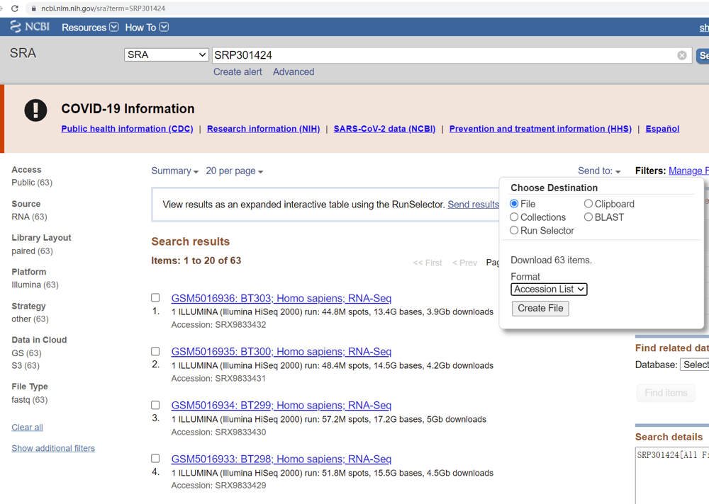
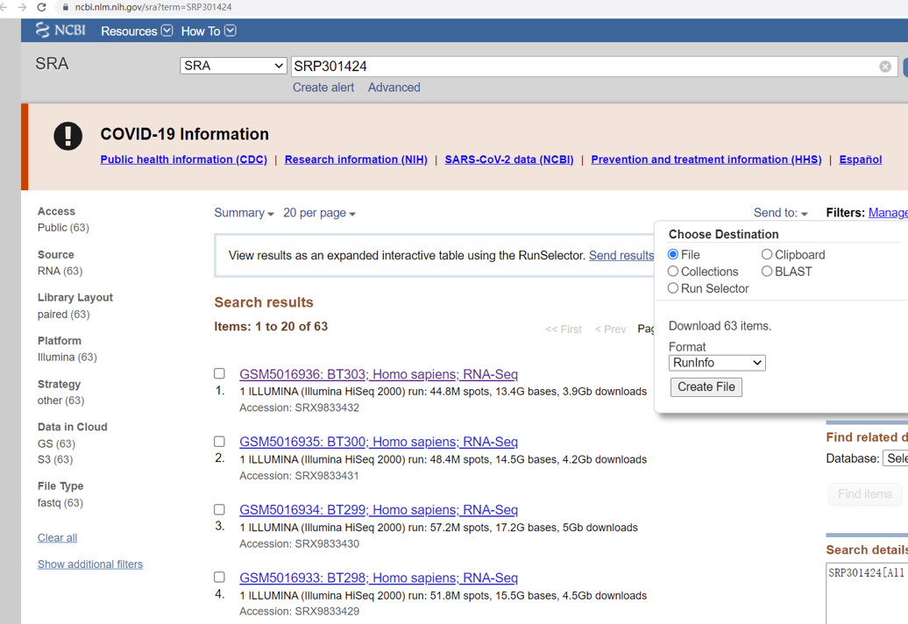

## Demo for RNASeq dataset

The purpose of this part: 

**present a demo for RNASeq dataset**.

The RNASeq dataset is from [GSE164677](https://www.ncbi.nlm.nih.gov/geo/query/acc.cgi?acc=GSE164677), which contains 59 Asian medulloblastoma and 4 normal tissues (para-tumor) including WNT, SHH, Group 3 and Group 4 medublastoma patients. Our purpose is to find hidden drivers in Group 4 medublastoma patients.

----------
## Quick Navigation for this page

- [Step 0: Prepare working directory,reference files and softwares](#step-0-prepare-working-directoryreference-files-and-softwares)
- [Step 1: Download RNASeq dataset from GEO database and convert to fastq files](#step-1-download-rnaseq-dataset-from-geo-database-and-convert-to-fastq-files)
- [Step 2: Run Salmon for quantifying the expression of transcripts](#step-2-run-salmon-for-quantifying-the-expression-of-transcripts)
- [Step 3: Load Salmon results into R and convert to eSet object](#step-3-load-salmon-results-into-r-and-convert-to-eset-object)
- [Step 4: Run NetBID2 for network construction](#step-4-run-netbid2-for-network-construction)
- [Step 5: Run NetBID2 for hidden driver estimation](#step-5-run-netbid2-for-hidden-driver-estimation)
- [Step 6: Run NetBID2 or NetBIDshiny for result visualization](#step-6-run-netbid2-or-netbidshiny-for-result-visualization)

---------

## Step 0: Prepare working directory,reference files and softwares
**Purpose: create an organized working directory.**

System: Linux, CentOS 7.8

Here, we show the way to manage the working directory of a project (suggested, not required). 

```{bash}
cd $HOME ## goto main working directory
project_name='Chinese_MB' ## set a project name
mkdir ${project_name}/ ## create a main working directory
cd $HOME/${project_name}/
mkdir src/ ## create directory to save the source code
mkdir soft/ ## create directory to save the software files
mkdir task/ ## create directory to save the batch bash files
mkdir db/ ## create directory to save the database files
mkdir data/ ## create directory to save the original data files
mkdir result/ ## create directory to save the result files
touch README.txt ## create one readme file to record each command
```
I: Download the human transcriptomic sequence from GENCODE:

GO TO: [https://www.gencodegenes.org/human/](https://www.gencodegenes.org/human/)

Download the fasta file: you could choose the newest version of the transcript sequence: [ftp://ftp.ebi.ac.uk/pub/databases/gencode/Gencode_human/release_31/gencode.v31.transcripts.fa.gz](ftp://ftp.ebi.ac.uk/pub/databases/gencode/Gencode_human/release_31/gencode.v31.transcripts.fa.gz).

You could download it in your server by the command:

```{bash}
cd $HOME/${project_name}/db/
wget http://ftp.ebi.ac.uk/pub/databases/gencode/Gencode_human/release_38/gencode.v38.transcripts.fa.gz
gunzip gencode.v38.transcripts.fa.gz
```

II: Download `salmon` and install

GO TO: [https://github.com/COMBINE-lab/salmon/releases](https://github.com/COMBINE-lab/salmon/releases)

Download the binary version of salmon, you could choose:
[https://github.com/COMBINE-lab/salmon/releases/download/v1.5.1/salmon-1.5.1_linux_x86_64.tar.gz](https://github.com/COMBINE-lab/salmon/releases/download/v1.5.1/salmon-1.5.1_linux_x86_64.tar.gz)

You could download it in your server by the command:

```{bash}
cd $HOME/${project_name}/soft/
wget https://github.com/COMBINE-lab/salmon/releases/download/v1.5.1/salmon-1.5.1_linux_x86_64.tar.gz
tar -xvf salmon-1.5.1_linux_x86_64.tar.gz
# set alias for salmon
alias salmon='$HOME/${project_name}/soft/salmon-1.5.1_linux_x86_64/bin/salmon'
```

III. Generate index files

Generate the index files by running the salmon:

```{bash}
cd $HOME/${project_name}/
salmon index -t db/gencode.v38.transcripts.fa -i db/Salmon_index_hg38
```

IV: Download `sra-tools` and install

GO TO: [https://github.com/ncbi/sra-tools/releases](https://github.com/ncbi/sra-tools/releases)

Download the binary version of sra-tools, you could choose: [https://github.com/ncbi/sra-tools/wiki/01.-Downloading-SRA-Toolkit](https://github.com/ncbi/sra-tools/wiki/01.-Downloading-SRA-Toolkit)


You could download it in your server by the command:

```{bash}
cd $HOME/${project_name}/soft/
wget http://ftp-trace.ncbi.nlm.nih.gov/sra/sdk/current/sratoolkit.current-centos_linux64.tar.gz
tar -xvf sratoolkit.current-centos_linux64.tar.gz
# set alias for prefetch
alias prefetch='$HOME/${project_name}/soft/sratoolkit.2.11.0-centos_linux64/bin/prefetch'
alias fastq-dump='$HOME/${project_name}/soft/sratoolkit.2.11.0-centos_linux64/bin/fastq-dump'
```

## Step 1: Download RNASeq dataset from GEO database and convert to fastq files

I: Find and download SRA accession list.

GO TO: [https://www.ncbi.nlm.nih.gov/geo/query/acc.cgi?acc=GSE164677](https://www.ncbi.nlm.nih.gov/geo/query/acc.cgi?acc=GSE164677)

Find the SRA ID at the "Relations" section. Here the ID is "SRP301424". Click it and GO TO: [https://www.ncbi.nlm.nih.gov/sra?term=SRP301424](https://www.ncbi.nlm.nih.gov/sra?term=SRP301424). At the page, click "Send to", choose "File", format select "Accession List", and click "Create File". 



Put the file "SraAccList.txt" into : $HOME/${project_name}/data/.

II: Run `prefetch` to download files. 

```{bash}
cd $HOME/${project_name}/data/
prefetch --option-file SraAccList.txt
```

III: Run `fastq-dump` to convert into fastq files. Here the original sequencing is pair-end.

```{bash}
cd $HOME/${project_name}
# Usage: fastq-dump --split-3 --gzip <input.sra> -O <output directory>
ls data/*/*sra | awk -F "\t" {'print "soft/sratoolkit.2.11.0-centos_linux64/bin/fastq-dump --gzip --split-3 "$1 " -O data/"'} >task/convert2fastq.sh
sh task/convert2fastq.sh ## at this step, users could use parallel computing strategy
# e.g cat task/convert2fastq.sh | parallel -j 8 &
```

## Step 2: Run Salmon for quantifying the expression of transcripts

I. As the original experiments contain multiple lanes (runs), we need to download the "SraRunInfo" file from SRA database. 

GO TO: [https://www.ncbi.nlm.nih.gov/sra?term=SRP301424](https://www.ncbi.nlm.nih.gov/sra?term=SRP301424). At the page, click "Send to", choose "File", format select "RunInfo", and click "Create File". 



Put the file "SraRunInfo.csv" into : $HOME/${project_name}/data/.

II. Generate bash script to run `Salmon`. Here, users may need to write a simple script to generate the salmon run script.

```{bash}
cd $HOME/${project_name}
mkdir result/salmon/ ## create salmon output directory
# get GSM list
awk -F ","  {'print $30'} data/SraRunInfo.csv | grep GSM | uniq >data/GSM.list
# remove the task/runSalmon.sh if already exist
if [ -e task/runSalmon.sh ]
then
    rm -f task/runSalmon.sh
fi
# create the task/runSalmon.sh file
touch task/runSalmon.sh
for each_GSM in `cat data/GSM.list`
do
  # for each GSM, find matched SRA id (multiple lanes)
  srr_1=`grep $each_GSM data/SraRunInfo.csv | awk -F "," {'print "data/"$1"_1.fastq.gz"'} | tr '\n' ' '`
  srr_2=`grep $each_GSM data/SraRunInfo.csv | awk -F "," {'print "data/"$1"_2.fastq.gz"'} | tr '\n' ' '`
  # Usage: salmon quant -i <ref> -l A -1 <R1_lane1 R1_lane2 ...> -2 <R2_lane1 R2_lane2 ...> -o <output directory>
  echo "soft/salmon-1.5.1_linux_x86_64/bin/salmon quant -i db/Salmon_index_hg38 -l A -1 $srr_1 -2 $srr_2 -o result/salmon/${each_GSM}" >>task/runSalmon.sh
done
```

III. Run `Salmon` and check the result files. 

```{bash}
cd $HOME/${project_name}
sh task/runSalmon.sh ## at this step, users could use parallel computing strategy
# e.g cat task/runSalmon.sh | parallel -j 8 &
```

The result files are in the `result/salmon/$GSM_ID/quant.sf`. Users could check `result/salmon/$GSM_ID/logs/salmon_quant.log` file to get the "Mapping rate". Try the following command to extract out all mapping rate information. 

```{bash}
cd $HOME/${project_name}
grep "Mapping rate" result/salmon/GSM*/*/*log
```

## Step 3: Load Salmon results into R and convert to eSet object

I: Open an R session, library `NetBID2` package. Create working directory. Use `load.exp.GEO` to load phenotype information from GEO database. 

```R
library(NetBID2)
project_main_dir <- 'result/'
project_name <- 'Chinese_MB'
network.par  <- NetBID.network.dir.create(project_main_dir=project_main_dir,project_name=project_name)
# get the phenotype information from GEO
gse <- load.exp.GEO(GSE='GSE164677',GPL='GPL11154',out.dir=network.par$out.dir.DATA)
gse <- update_eset.phenotype(gse,use_col='GEO-auto')
phe <- pData(gse)
```

II: Load salmon results. 

```R
# load salmon results, choose gene level here
eSet_expGene <- load.exp.RNASeq.demoSalmon(salmon_dir='result/salmon/',
            use_phenotype_info = phe, 
            use_sample_col = "geo_accession",
            use_design_col  = "medulloblastoma subgroup",
            merge_level = "gene",return_type = "eset")
```

**Note**: The return_type could be 'txi','counts','tpm','fpm','cpm','raw-dds','dds','eset'.
RPM, RPKM/FPKM and TPM, please check: https://www.biostars.org/p/273537/ , https://www.ncbi.nlm.nih.gov/pmc/articles/PMC4728800/ for detailed description.

--> RPM: reads per million mapped reads
--> FPM: fragments per million mapped fragments
--> CPM: counts per million mapped fragments
FPM/RPM does not consider the transcript length normalization.
FPM/RPM Suitable for sequencing protocols where reads are generated irrespective of gene length

--> RPKM: reads per kilobase per million mapped reads
--> FPKM: fragments per kilobase per million mapped fragments
FPKM/RPKM considers the gene length for normalization
FPKM/RPKM is suitable for sequencing protocols where reads sequencing depends on gene length
RPKM used in single-end RNA-seq experiments, FPKM for paired-end RNA-seq data

--> TPM: Transcript per million
TPM considers the gene length for normalization
TPM proposed as an alternative to RPKM due to inaccuracy in RPKM measurement (Wagner et al., 2012)
TPM is suitable for sequencing protocols where reads sequencing depends on gene length

--> Comparison:
In TPM, we adjust 'transcripts' in TPM while we adjust 'reads' in FPKM.

## Step 4: Run NetBID2 for network construction

I: Get ID transfer table. Generate eSet. Get QC file for the eSet. Save RData. 

```R
# prepare transfer table
# here the downloaded gencode contains the ID transfer information, users could directly read it
tmp1 <- read.delim('result/salmon/GSM5016874/quant.sf',stringsAsFactors=F)
tmp2 <- as.data.frame(do.call(rbind,lapply(tmp1$Name,function(x)unlist(strsplit(x,'\\|')))),stringsAsFactors=F)
transfer_tab <- tmp2;
colnames(transfer_tab)[c(2,6,8)] <- c('ensembl_gene_id','external_gene_name','transcript_biotype')

# or use our function to download it
transfer_tab <- get_IDtransfer2symbol2type(from_type='ensembl_gene_id',
                dataset = 'hsapiens_gene_ensembl',
                use_level='gene',ignore_version = T)

# update eset
eSet_expGene <- update_eset.feature(use_eset=eSet_expGene,
                          use_feature_info=transfer_tab,
                          from_feature='ensembl_gene_id',
                          to_feature='external_gene_name',
                          merge_method='median')
```                        

II: Generate eSet. Get QC file for the eSet. Save RData. 

```R
# generate eSet object
network.par$net.eset <- eSet_expGene

# QC for the raw eset
draw.eset.QC(network.par$net.eset,outdir=network.par$out.dir.QC,
             intgroup='medulloblastoma subgroup',do.logtransform=FALSE,prefix='beforeQC_',
             pre_define=c('WNT'='blue','SHH'='red','Group3'='yellow','Group4'='green','n/a (NORM)'='grey'),
             generate_html=FALSE)
# if pandoc is installed, user could set generate_html=TRUE

# Save network.par as RData
NetBID.saveRData(network.par = network.par,step='exp-load')
```

III. Normalization for the expression dataset. In the previous step, we have already applied DESeq2 normalization process. Here, just remove genes with too low expression level. 

```R
# NetBID.loadRData(network.par = network.par,step='exp-load')
mat <- exprs(network.par$net.eset)
choose1 <- apply(mat<= quantile(mat, probs = 0.05), 1, sum)<= ncol(mat) * 0.90
print(table(choose1))
mat <- mat[choose1,]
# Update eset with normalized expression matrix
net_eset <- generate.eset(exp_mat=mat, phenotype_info=pData(network.par$net.eset)[colnames(mat),],
                            feature_info=fData(network.par$net.eset)[rownames(mat),],
                            annotation_info=annotation(network.par$net.eset))
# Update network.par with new eset
network.par$net.eset <- net_eset
# draw QC
draw.eset.QC(network.par$net.eset,outdir=network.par$out.dir.QC,
             intgroup='medulloblastoma subgroup',do.logtransform=FALSE,prefix='afterQC_',
             pre_define=c('WNT'='blue','SHH'='red','Group3'='yellow','Group4'='green','n/a (NORM)'='grey'),
             generate_html=FALSE)
# if pandoc is installed, user could set generate_html=TRUE
# Save network.par as RData
NetBID.saveRData(network.par = network.par,step='exp-QC')

# check sample cluster
intgroup <- 'medulloblastoma subgroup'
mat <- exprs(network.par$net.eset)
choose1 <- IQR.filter(exp_mat=mat,use_genes=rownames(mat),thre = 0.8)
print(table(choose1))
mat <- mat[choose1,]
pred_label <- draw.emb.kmeans(mat=mat,all_k = NULL,obs_label=get_obs_label(phe,intgroup),
                                pre_define=c('WNT'='blue','SHH'='red','G4'='green'))
```

III. Prepare files to run SJARACNe.

```R
# Load database
db.preload(use_level='gene',use_spe='human',update=FALSE)

# Converts gene ID into the corresponding TF/SIG list
use_gene_type <- 'external_gene_name' # user-defined
use_genes <- rownames(fData(network.par$net.eset))
use_list  <- get.TF_SIG.list(use_genes,use_gene_type=use_gene_type)

# Select samples for analysis
phe <- pData(network.par$net.eset)
use.samples <- rownames(phe) # here is using all samples, users can modify
prj.name <- network.par$project.name # if use different samples, need to change the project name
SJAracne.prepare(eset=network.par$net.eset,use.samples=use.samples,
                 TF_list=use_list$tf,SIG_list=use_list$sig,
                 IQR.thre = 0.5,IQR.loose_thre = 0.1,
                 SJAR.project_name=prj.name,SJAR.main_dir=network.par$out.dir.SJAR)
```

IV. Run SJARACNe.

Follow the instructions at [github](https://github.com/jyyulab/SJARACNe) to download and install SJARACNe. Using conda is strongly suggested.

Then, go to the main directory for running SJAR. For the current version of sjaracne, the running command is different. 

```{bash}
cd $HOME/${project_name}/result/Chinese_MB/SJAR/Chinese_MB
sjaracne local -e input.exp -g tf.txt -o output_tf
sjaracne local -e input.exp -g sig.txt -o output_sig
```

## Step 5: Run NetBID2 for hidden driver estimation

I. Create main parameter "analysis.par" and read in network files. 

```R
analysis.par  <- NetBID.analysis.dir.create(project_main_dir=project_main_dir,  
                  project_name=project_name,
                  tf.network.file='result/Chinese_MB/SJAR/Chinese_MB/output_tf/consensus_network_ncol_.txt',
                  sig.network.file='result/Chinese_MB/SJAR/Chinese_MB/output_sig/consensus_network_ncol_.txt')
analysis.par$tf.network  <- get.SJAracne.network(network_file=analysis.par$tf.network.file)
analysis.par$sig.network <- get.SJAracne.network(network_file=analysis.par$sig.network.file)
# Creat QC report for the network
draw.network.QC(analysis.par$tf.network$igraph_obj,outdir=analysis.par$out.dir.QC,prefix='TF_net_',html_info_limit=FALSE,generate_html=FALSE)
draw.network.QC(analysis.par$sig.network$igraph_obj,outdir=analysis.par$out.dir.QC,prefix='SIG_net_',html_info_limit=TRUE,generate_html=FALSE)
# if pandoc is installed, user could set generate_html=TRUE

# Merge network 
analysis.par$merge.network <- merge_TF_SIG.network(TF_network=analysis.par$tf.network,SIG_network=analysis.par$sig.network)
```

II. Get activity matrix

```R
# Get activity matrix
analysis.par$cal.eset <- network.par$net.eset # here use the same eSet, user could choose to use different dataset for network construction and NetBID2 anlaysis
ac_mat <- cal.Activity(target_list=analysis.par$merge.network$target_list,
            cal_mat=exprs(analysis.par$cal.eset),es.method='weightedmean')

# Create eset using activity matrix
analysis.par$merge.ac.eset <- generate.eset(exp_mat=ac_mat,phenotype_info=pData(analysis.par$cal.eset)[colnames(ac_mat),],
                                            feature_info=NULL,annotation_info='activity in net-dataset')

# QC plot for activity eset
draw.eset.QC(analysis.par$merge.ac.eset,outdir=analysis.par$out.dir.QC,intgroup=NULL,do.logtransform=FALSE,prefix='AC_',
             pre_define=c('WNT'='blue','SHH'='red','G4'='green'),
             emb_plot_type='2D.interactive',generate_html=FALSE)
# if pandoc is installed, user could set generate_html=TRUE
# Save analysis.par as RData
NetBID.saveRData(analysis.par=analysis.par,step='act-get')
```

III. Get differential analysis for Group4 Vs. other tumor samples and Group4 Vs. normal samples. 

```R
# Create empty list to store comparison result
analysis.par$DE <- list()
analysis.par$DA <- list()

# First comparison: G4 vs. other tumor samples
comp_name <- 'G4.Vs.otherT' # Each comparison must has a name
# Get sample names from each compared group
phe_info <- pData(analysis.par$cal.eset)
G1  <- rownames(phe_info)[which(phe_info$`medulloblastoma subgroup`=='Group4')] # Experiment group
G0  <- rownames(phe_info)[which(phe_info$`medulloblastoma subgroup` %in% c('Group3','SHH','WNT'))] # Control group
DE_gene_bid <- getDE.BID.2G(eset=analysis.par$cal.eset,G1=G1,G0=G0,G1_name='G4',G0_name='otherT')
DA_driver_bid   <- getDE.BID.2G(eset=analysis.par$merge.ac.eset,G1=G1,G0=G0,
                    G1_name='G4',G0_name='otherT')
# Save comparison result to list element in analysis.par, with comparison name
analysis.par$DE[[comp_name]] <- DE_gene_bid
analysis.par$DA[[comp_name]] <- DA_driver_bid

# Second comparison: G4 vs. other tumor samples
comp_name <- 'G4.Vs.NORM' # Each comparison must has a name
# Get sample names from each compared group
phe_info <- pData(analysis.par$cal.eset)
G1  <- rownames(phe_info)[which(phe_info$`medulloblastoma subgroup`=='Group4')] # Experiment group
G0  <- rownames(phe_info)[which(phe_info$`medulloblastoma subgroup`=='n/a (NORM)')] # Control group
DE_gene_bid <- getDE.BID.2G(eset=analysis.par$cal.eset,G1=G1,G0=G0,G1_name='G4',G0_name='NORM')
DA_driver_bid   <- getDE.BID.2G(eset=analysis.par$merge.ac.eset,G1=G1,G0=G0,
                    G1_name='G4',G0_name='NORM')
# Save comparison result to list element in analysis.par, with comparison name
analysis.par$DE[[comp_name]] <- DE_gene_bid
analysis.par$DA[[comp_name]] <- DA_driver_bid

# Combine the comparison results from `G4.Vs.otherT` and `G4.Vs.NORM`
comp_name <- 'G4.Vs.others' # Each comparison must has a name
DE_gene_comb <- combineDE(DE_list=list('G4.Vs.otherT'=analysis.par$DE$`G4.Vs.otherT`,'G4.Vs.NORM'=analysis.par$DE$`G4.Vs.NORM`))
DA_driver_comb <- combineDE(DE_list=list('G4.Vs.otherT'=analysis.par$DA$`G4.Vs.otherT`,'G4.Vs.NORM'=analysis.par$DA$`G4.Vs.NORM`))
analysis.par$DE[[comp_name]] <- DE_gene_comb$combine
analysis.par$DA[[comp_name]] <- DA_driver_comb$combine
```

IV. Draw figures for top DE (differential expression) genes or DA (differential activity) drivers.

```
# Driver table of top DE
#draw.combineDE(DE_gene_comb)
draw.combineDE(DE_gene_comb,pdf_file=sprintf('%s/combineDE.pdf',analysis.par$out.dir.PLOT)) # Save it as PDF

# Driver table of top DA
#draw.combineDE(DA_driver_comb)
draw.combineDE(DA_driver_comb,pdf_file=sprintf('%s/combineDA.pdf',analysis.par$out.dir.PLOT)) # Save it as PDF
```

V. Generate a master table for drivers and save the results into RData.

```R
db.preload(use_level='gene',use_spe='human',update=FALSE)
# Get all comparison names
all_comp <- names(analysis.par$DE) # Users can use index or name to get target ones
# Prepare the conversion table (OPTIONAL)
use_genes <- unique(c(analysis.par$merge.network$network_dat$source.symbol,
              analysis.par$merge.network$network_dat$target.symbol))
analysis.par$transfer_tab <- transfer_tab
# Creat the final master table
analysis.par$final_ms_tab <- generate.masterTable(use_comp=all_comp,DE=analysis.par$DE,DA=analysis.par$DA,                                        target_list=analysis.par$merge.network$target_list,                                             tf_sigs=tf_sigs,z_col='Z-statistics',display_col=c('logFC','P.Value'),main_id_type='external_gene_name')

# Path and file name of the output EXCEL file
out_file <- sprintf('%s/%s_ms_tab.xlsx',analysis.par$out.dir.DATA,analysis.par$project.name)
# Highlight marker genes for Group4
mark_gene <- list(G4=c('KCNA1','EOMES','KHDRBS2','RBM24','UNC5D'))
# Customize highlight color codes
#mark_col <- get.class.color(names(mark_gene)) # this randomly assign color codes
mark_col <- list(G4='green','WNT'='blue','SHH'='red')
# Save the final master table as EXCEL file
out2excel(analysis.par$final_ms_tab,out.xlsx = out_file,mark_gene,mark_col)

# Save analysis.par as RData, ESSENTIAL
NetBID.saveRData(analysis.par=analysis.par,step='ms-tab')
```

## Step 6: Run NetBID2 or NetBIDshiny for result visualization

```R

```

-------


