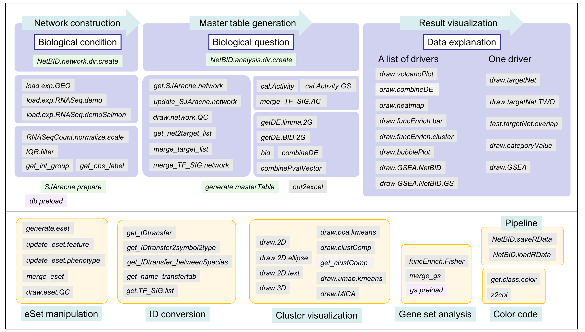

# NetBID2: Network-based Bayesian Inference of Drivers. Version 2
{: .fs-9 }

This is the documentation for the usage of NetBID2.
{: .fs-6 .fw-300 }

[Get started now](#getting-started){: .btn .btn-primary .fs-5 .mb-4 .mb-md-0 .mr-2 } [View it on GitHub](https://github.com/jyyulab/NetBID-dev){: .btn .fs-5 }

---

## Overview

NetBID is a systems biology tool called data-driven network-based Bayesian inference of drivers, by integrating data from transcriptomics,proteomics and phosphoproteomics.

The drivers could be transcription facotrs (**TF**) or signaling factors (**SIG**).

NetBID2 is the second version of NetBID, which not only covers the main functions of NetBID, but also provides plenty of supporting functions and suggested workflow to finish a NetBID2-based analysis:

**Provide data processing functions to assist** 

- Expression matrix pre-processing and quality assessment
- SJAracne-based network construction
- Activity calculation for drivers and gene sets
- Estimation of differentiated expressed genes or differentiated activated drivers
- Generation of master table for drivers

**Provide visualization functions to assist**

- Unsupervised clustering for samples and comparison with known labels
- Display of a list of interested drivers, the profile of the significance and the feature of the target genes
- Display of a specific driver, the profile of the significance, the feature of the target genes and the detailed network structure

**Provide supporting functions to assist**

- Gene/transcript ID conversion
- Gene function enrichment analysis & result visualization
- Data and pipeline management

---

## Getting started

### Dependencies

R, version >= 3.4.0

[Pre-request R packages](docs/pre_request)


### Quick start: install R packages (NetBID2)

- install the R packages from github (not published yet)

```R
library(devtools)
install_github("jyyulab/NetBID-dev",ref='master')
```

- OR, download the released source package from [NetBID2_0.1.1.tar.gz](https://github.com/jyyulab/NetBID-dev/releases/download/NetBID2-R/NetBID2_0.1.1.tar.gz) and local install

```R
install.packages('NetBID2_0.1.1.tar.gz',repos=NULL)
```

---

## Design manual

The manual for all functions in NetBID2 could be obtained from [NetBID2_0.1.1.pdf](https://github.com/jyyulab/NetBID-dev/blob/master/NetBID2_0.1.1.pdf). All functions have the demo scripts.

All 67 invokable functions could be grouped as shown in the figure below:



NetBID2 has four functions focusing on suggested pipeline (not required):

- `NetBID.network.dir.create()` will generate a working directory structure for the network generation part in NetBID2. This function aims to assist researchers to organize the working directory. 

- `NetBID.analysis.dir.create()`  will generate a working directory structure for the driver analysis part in NetBID2. This function aims to assist researchers to organize the working directory. 

- `NetBID.saveRData()` save the dataset of one designated step  the step into file.

- `NetBID.loadRData()` load the dataset of one designated step from file.

Users could save two complicate list object, `network.par` in the **network generation part** and `analysis.par` in the **driver analysis part**, into the data directory (`network.par$out.dir.DATA` or `analysis.par$out.dir.DATA`), with the name of the RData marked by step name. 
The two lists could make user to save the whole related dataset in each step `NetBID.saveRData()` and easy to get them back by using `NetBID.loadRData()`. 
The RData saved from each step could be used to run the following analysis without repeating the former steps.

The pipeline steps are suggested in the figure below with detailed component for the list object in the final step in the two parts:


Strongly suggest new users to follow the pipeline to manage the analysis project. The pipeline is included in the tutorial below. User could follow the demo in the tutorial for better understanding the design.

Most of the functions in NetBID2 are not strictly dependent on the pipeline object, user could try to learn the usage of each function by running the example in each function and prepare the required input by themselves. 

## Tutorial
 
We choose the demo dataset from GEO database: [GSE116028](https://www.ncbi.nlm.nih.gov/geo/query/acc.cgi?acc=GSE116028). 

This dataset contains microarray data for 13 adult medulloblastoma (MB) samples. 
Three subgroups of adult MB were identified by distinct expression profiles, clinical features, pathological features, and prognosis, including 3 SHH, 4 WNT, and 6 Group4.
From them, Group4 tumors had significantly worse progression-free and overall survival compared with tumors of the other molecular subtypes. 
Here, we want to **find potential hidden drivers in Group4 compared with the other subtypes by using NetBID2**, for which may be related with the specific clinical feature for Group4 MB.
 
**Though the dataset in the tutorial is microarray, we will include the usage of processing RNASeq dataset in each step.**  
 
The tutorials are divided by three ordered and relatively independent parts as follows:

1. [Network generation](docs/network_generation)

2. [Driver estimation](docs/driver_estimation)

3. [Advanced analysis](docs/advanced_analysis)

---

## About the project

For the detailed description of NetBID algorithm, please refer our lab page [View Yu Lab@St. Jude](https://stjuderesearch.org/site/lab/yu).

### License

Distributed by an MIT license.
